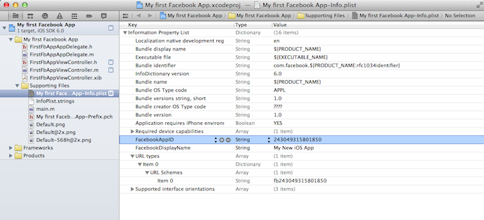

## Tích Hợp FacebookSDK với AppotaSDK

### Cài Đặt FacebookSDK
- Tải FacebookSDK từ [https://developers.facebook.com/resources/facebook-ios-sdk-current.pkg](https://developers.facebook.com/resources/facebook-ios-sdk-current.pkg) hoặc tải từ [AppotaSDK example](GameIntegration/AppotaGameTest/FacebookSDK.framework/)
- Kéo và thả FacebookSDK.framework vào project của bạn.

- Tick vào checkbox: “Copy items into destination group's folder (if needed)”.
Trong Project app’s target, Chọn Build phases ->
Link Binary with Libraries. Click vào button ‘+’ và add thêm vào các framework sau:

```
AdSupport.framework, Account.framework, Social.framework, libsqllite3.dylib
```

### Cấu hình file  .plist của project với FacebookAppID
- nhận FacebookAppID bằng việc tạo facebook app từ [https://developers.facebook.com](https://developers.facebook.com) (có thể liên hệ với Appota Game team để tạo facebbok app hoặc tự tạo facebook app của chính bạn). Cấu FacebookAppID rất giống với AppotaID
- Tạo một key được gọi là *FacebookAppID* với giá trị kiểu string, và thêm app ID vào đó.
- Tạo một mảng key  có tên URL types với duy nhất một mảng sub-item tên gọi URL Schemes. thêm một item vào (item này được tạo ra từ app ID bằng cách thêm vào tiền tố fb). Nó được sử dụng để đảm bảo rằng ứng dụng nhận callback URL của web-based OAuth.
Sua khi cấu hình xong file .plist sẽ như sau:
 

### Thêm sử lý đăng nhập vào AppDelegate
- Thêm xử lý mở URL từ AppDelegate bởi hàm sau :
		
	```objc
	(BOOL) application:(UIApplication *)application openURL:(NSURL *)url sourceApplication:(NSString *)sourceApplication annotation:(id)annotation {
    		return [AppotaGameSDKConfigure handleOpenURL:url sourceApplication:sourceApplication annotation:annotation];
	}
	```
