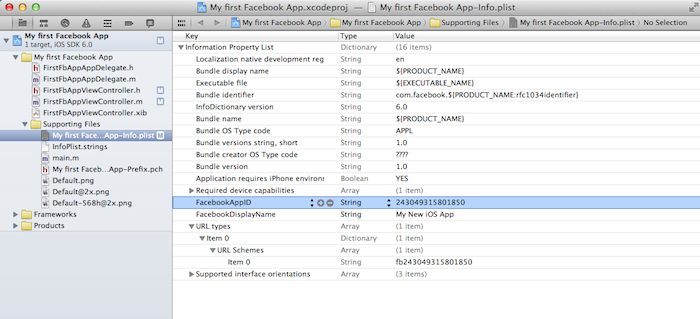

## Integrate FacebookSDK with AppotaSDK

### Setup FacebookSDK
- Download FacebookSDK from [https://github.com/facebook/facebook-ios-sdk](https://github.com/facebook/facebook-ios-sdk) or from [AppotaSDK example](GameIntegration/AppotaGameTest/FacebookSDK.framework/)
- Drag and drop FacebookSDK.framework into your project.

- Tick on checkbox: “Copy items into destination group's folder (if needed)”.
In Project app’s target settings section, find [Build phases] and open
Link Binary with Libraries. Click on ‘+’ button and add these frameworks:

```
AdSupport.framework, Account.framework, Social.framework, libsqllite3.dylib
```

### Config plist with FacebookAppID
- Get FacebookAppID from [https://developers.facebook.com](https://developers.facebook.com) (contact Appota Game team to create or create your own facebook app). Config FacebookAppID is much like AppotaID
- Create a key called *FacebookAppID* with a string value, and add the app ID there.
- Create an array key called URL types with a single array sub-item called URL Schemes. Give this a single item with your app ID prefixed with fb. This is used to ensure the application will receive the callback URL of the web-based OAuth flow.
The finished .plist should look something like this:
 

### Add login handler in AppDelegate
- Add handle open URL in your AppDelegate by this function :
		
	```objc
	(BOOL) application:(UIApplication *)application openURL:(NSURL *)url sourceApplication:(NSString *)sourceApplication annotation:(id)annotation {
    		return [AppotaGameSDKConfigure handleOpenURL:url sourceApplication:sourceApplication annotation:annotation];
	}
	```