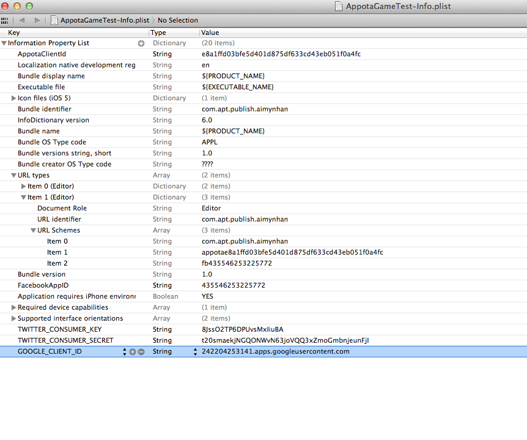

### Setup GoogleSDK
### Config GOOGLE_CLIENT_ID và GOOGLE_CLIENT_SECRET trong plist
- Tạo *GOOGLE_CLIENT_ID* từ [https://console.developers.google.com/project](console.developers.google.com/project) tự tạo Google Client cho iOS theo hướng dẫn tại https://developers.google.com/+/mobile/ios/getting-started hoặc contact Appota AM để lấy *GOOGLE_CLIENT_ID*
- Tạo key *GOOGLE_CLIENT_ID* trong plist với giá trị dạng string là Google Client ID cho iOS từ https://console.developers.google.com/project
- Tạo key *GOOGLE_CLIENT_SECRET* trong plist với giá trị dạng string là Google Client Secret cho iOS từ https://console.developers.google.com/project.
.plist hoàn thành có dạng như trong ảnh:
 