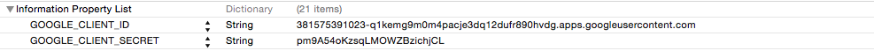

## Integrate GoogleSDK with AppotaSDK

### Setup GoogleSDK
- Download Google SDK from [https://developers.google.com/+/mobile/ios/getting-started](https://developers.google.com/+/mobile/ios/getting-started) or from [AppotaSDK example](GameIntegration/AppotaGameTest/GooglePlus.framework/)
- Drag and drop *GoogleOpenSource.framework, GooglePlus.bundle, GooglePlus.framework* into your project.
- In Project app’s target settings section, find [Build phases] and open
Link Binary with Libraries. Click on ‘+’ button and add these frameworks:

```
AddressBook.framework
AssetsLibrary.framework
CoreLocation.framework
CoreMotion.framework
CoreGraphics.framework
CoreText.framework
MediaPlayer.framework
Security.framework
SystemConfiguration.framework
UIKit.framework
```

### Config GoogleClientID
- Get GoogleClientID from [https://developers.google.com/+/mobile/ios/getting-started](https://developers.google.com/+/mobile/ios/getting-started) (contact Appota Game team to create or create your own google app). If you create the app on your own, please follow instruction from developer.google
- Create a key called *GOOGLE_CLIENT_ID* with a string value, and add the app ID there.
- Create schemes for google login (in URLTypes), add your bundle id as url scheme
The finished .plist should look something like this:
 
### Add login handler in project
- In you source code (after init SDK), please set googleClientID by function *[AppotaGameSDKConfigure shareConfige].googleClientID = @"YourGoogeClientID"*
- Add handle open URL in your AppDelegate by this function :
		
	```objc
	(BOOL) application:(UIApplication *)application openURL:(NSURL *)url sourceApplication:(NSString *)sourceApplication annotation:(id)annotation {
    		return [AppotaGameSDKConfigure handleOpenURL:url sourceApplication:sourceApplication annotation:annotation];
	}
	```