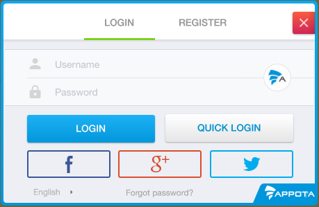
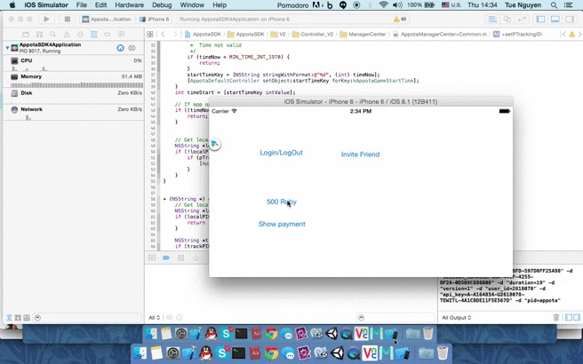

#IOS的APPOTA  Game SDK第四版本

<b>在Appota游戏的iOS4版本整合Facebook的iOS SDK4.2版已刊登于本reposity和开发人员预览版。[施氮，我们有Appota SDK4，integerate Facebok的iOS的SDK版本3](https://github.com/appota/ios-game-sdk/tree/facebooksdkv3).第3版本还在 [appota-ios-game-sdk3](https://github.com/appota/ios-game-sdk3) repository. </b>


##重点

* **Appota Login** – 支持Appota, Google, Facebook, Twitter, Guest多种登录方式.
* **Appota Payment** – 支持SMS, Card, E-Bank, Apple Payment多种支付方式.
* **Appota Analytics** – 可收集、可视化并了解用户以及应用数据(session, active, error log ...)的一种服务.
* •	为IOS、安卓、window phone各种平台支持 **Push Notification**（推送通知）

## 概括
1. [集成SDK](#head1-integrate-sdk)
	* 1.1 [首先要求](#head2-prerequisites)
	* 1.2 [接受 APP api key 和客户端 key](#head2-obtain-app-api-key-and-client-key)
	* 1.3 [Xcode Project配置](#head2-configure-your-xcode-project)
	* 1.4 [更新sdk 版本](#head2-update-the-sdk-to-a-newer-version)
2. [客户端的 APIs](#head1-client-api)
    * 2.1 [初始化和配置SDK](#head2-init-sdk)
    * 2.2 [用户函数](#head2-user-function)
    * 2.3 [支付函数](#head2-payment-function)
    * 2.4 [分析、统计函数](#head2-analytic-function)
    * 2.5 [push notification相关函数](#head2-push-notification-function)
    * 2.6 [游戏里设置角色函数](#head2-set-game-character)
    * 2.7 [其他函数](#head2-advance-function)
3. [其他函数](#head1-class-document)
4. [FAQ and Glossary 常见问题及词汇表](#head1-faq)

##1. 集成 SDK <a name = "head1-integrate-sdk"> </a>
示例项目 [sample apps](Sample/) 是为您设置的项目。您也可以集成 IOS SDK到现有应用.

###1.1. 先决要求 <a name = "head2-prerequisites">  </a>
To get started with the Appota Game SDK for iOS, you can set up the SDK and start building a new project, or you can integrate the SDK in an existing project. You can also run the samples to get a sense of how the SDK works.

The Appota Game SDK for iOS supports the following versions of software:

* Xcode 6 以及更新版本
* iOS 6 以及更新版本

###1.2. 获取app api key 和客户端key <a name="head2-obtain-app-api-key-and-client-key"> </a>
* 从应用管理页面取得 `ClientKey`, `APIKey`, `ClientSecret` 等Appota应用. 若您还没向Appota注册Appota应用，您应该 [建设新应用](https://developer.appota.com/manage-content.html):  
* 获取 Facebook Application ID.建设, <a name="head3-facebook-appid"> </a> [获取及设置IOS的Facebook app info 具体查看](https://developers.facebook.com/docs/ios/getting-started). 
*  获取 Facebook App Link.建设, <a name = "head3-facebook-app-link"> </a>  [获取及设置IOS的Facebook app link 具体查看](https://developers.facebook.com/docs/app-invites/ios)  -> [App Link Tool](https://developers.facebook.com/quickstarts/?platform=app-links-host). 
* 获取  Google Client ID 和 Client Secret. 建设, <a name="head3-google-appid"> </a> [获取及设置IOS的Google app 具体查看](https://developers.google.com/+/mobile/ios/getting-started)
* •	获取 Twitter Consumer Key 和 Twitter Consumer Secret Key. 建设, <a name= "head3-twitter-appid"> </a> [获取及设置IOS的Twitter app 具体查看](https://apps.twitter.com/)

###1.3. 您Xcode Project的配置 <a name="head2-configure-your-xcode-project"> </a>

####1.3.1. 添加 Appota iOS SDK 到您的Xcode Project
 打开 [ios-game-sdk/Frameworks](Frameworks/) 并添加 [AppotaSDK.framework](Frameworks/AppotaSDK.framework), [AppotaBundle.bundle](Frameworks/AppotaBundle.bundle), [FBSDKCoreKit.framework](Frameworks/FBSDKCoreKit.framework),
 [FBSDKLoginKit.framework](Frameworks/FBSDKLoginKit.framework), 
[FBSDKShareKit.framework](Frameworks/FBSDKShareKit.framework) 到您的项目. (注意选择 **Create groups for any added folders** 和选  **Copy items into destination group's folder (if needed)**)


####1.3.2. 添加并安装框架依赖
从Project Navigator选择您的项目→并选择应用程序的目标。打开构建阶段选项卡，在链接的二进制库部分，添加以下框架: 

- `StoreKit.framework`  
- `Accounts.framework`  
- `Social.framework`  
- `Twitter.framework`
- `ImageIO.framework`
- `CoreTelephony.framework`
- `AdSupport.framework`
- `SystemConfiguration.framework`
- `MessageUI.framework`
- `CoreMotion.framework`
-  `Security.framework`

打开 **Build Settings**, 找 **Other Linker Flags**, 添加 `-ObjC` 然后把  **Link Frameworks Automatically**, **Enable Modules (C and Objectivce-C))** 都设为 `YES`


####1.3.3. Info `.plist` 文件配置

- 打开 Info `plist` 输入您的 `FacebookAppID` key with value is your [Facebook AppID](#head3-facebook-appid).
- 打开 Info `plist` 输入您的 `FacebookAppLinkUrl` key with value is your [Facebook App Link](#head3-facebook-app-link).
- 打开 Info `plist` 输入您的 `GOOGLE_CLIENT_ID` 到 `GOOGLE_CLIENT_SECRET` [Google Client Id and Sceret](#head3-google-appid).
- 打开 Info `plist` 输入您的 `TWITTER_CONSUMER_KEY` 到 `TWITTER_CONSUMER_SECRET` key. [Twitter consumer key and twitter consumer secret](#head3-twitter-appid).
- 打开 Info `plist` 输入您的 `AppotaAPIKey` 到 [Appota APIKey](#head3-appota-appid).
- 添加 url 方案:
	- Appota 的标识, URL Schemes: `appotaYOUR_CLIENT_KEY`, [Appota Client Key](#head3-appota-appid) 可以从 Developer.appota.com 应用程序仪表板获得
	- Facebook 的标识, URL Schemes: `fbYOUR_FACEOOK_APP_ID`, [Facebook AppID](#head3-facebook-appid) 可以从Facebook应用程序仪表板获得.

一个完整的 `.plist` 文件就像下面图片或您可在 [sample apps](Sample/) 查看


####1.4. 更新 SDK 更新 <a name="head2-update-the-sdk-to-a-newer-version"> </a>

我们推出SDK新版本之时，您可看下面的描述改变.

* •	在Xcode中选择以下框架和捆绑，然后点击键盘上的 **delete**. Then select **Move to Trash**:

    * `ApppotaFramework.framework`
    * `AppotaBundle.bundle`
    * `FBSDKCoreKit.framework`
    * `FBSDKLoginKit.framework`
    * `FBSDKShareKit.framework`
    
* Include SDK的新版本按照 [上面](#head1-integrate-sdk) 的设置过程


##2. 客户端的  <a name="head1-client-api"> </a>

###2.1 初始化和配置 SDK <a name = "head2-init-sdk"> </a>

相关class 和函数：

[AppotaGameSDK class - 初始化函数](class-document/AppotaGameSDK-class.md#init-function)

初始化 **Appota SDK** 当应用通过 [AppotaGameSDK](class-document/AppotaGameSDK-class.md#init-function) class调用  `[AppotaGameSDK configure]` 时必要被调用一次。大多数使用下面方式来调用：`application:didFinishLaunchingWithOptions:`  
在 `AppDelegate.h` 文件添加  import `#import <AppotaSDK/AppotaSDK.h>` 使用 `AppDelegate` 像一个 protocol:

```
@interface AppDelegate : UIResponder <UIApplicationDelegate, AppotaGameSDKCallback>
```

在 `AppDelegate.m`:

```
- (BOOL)application:(UIApplication *)application didFinishLaunchingWithOptions:(NSDictionary *)launchOptions
{		
	// Your code is placed above
	[AppotaGameSDK configure];
 	[AppotaGameSDK sharedInstance].delegate = self;	
 }
```

在 function中添加 handle open URL :  `application:openURL:sourceApplication:annotation:`

```
- (BOOL) application:(UIApplication *)application openURL:(NSURL *)url sourceApplication:(NSString *)sourceApplication annotation:(id)annotation {
    return [AppotaGameSDK  application:application handleOpenURL:url sourceApplication:sourceApplication annotation:annotation];
}
```
有 4 种 function 可用来 control SDK follow:

- `setKeepLoginSession:(BOOL)` :(BOOL)这个function将控制 Appota Login Session 在应用运行时可保留还是删除 (删除Login Session时用户要重新登录).**注意** 若不调用该函数，Login session将默认保留.

- `setAutoShowLoginDialog:(BOOL)` <a name="set-auto-show-login-dialog"> </a> t:(BOOL)这个function 将控制 Appota Login View 在运行应用之时自动show (用户尚未登录)或您要调用 [showLoginView](#show-login-view) 才能show 若您不调用这个函数，默认Login View将自动显示.
- `setSDKButtonVisibility:(BOOL)` <a name = "set-sdk-button-visible"> </a>当您想要隐藏或显示SDK浮动按钮时调用这个函数。
**注意** 若您不调用这个函数，默认SDK Button将在运行应用之时自动显示.

- `setHideWelcomeView:(BOOL)` <a name = "set-hide-wellcome-view"> </a> 当您想要隐藏或显示Welcome View是调用这个函数.
**注意** 若您不调用这个函数，默认Welcome View将在运行应用之时自动显示。
###2.2.相关用户函数 <a name="head2-user-function"> </a>
相关用户函数:

- [AppotaGameSDK- user function](class-document/AppotaGameSDK-class.md#user-function)
- [AppotaUserLoginResult](class-document/AppotaUserLoginResult-class.md)


当完成 **SDK** 初始化时，开启使用登录功能.

####2.2.1. 显示登陆界面 <a name = "head2-show-login-view"> </a>
以上面所提，**Login Dialog** 可用 [setAutoShowLoginDialog:](#set-auto-show-login-dialog).控制。若您不要自动显示登录界面，需要时您可以手动调用 `showLoginView` 函数

•	显示登陆界面

```
[AppotaGameSDK showLoginView];
```
<a name="show-login-view"> </a>
Appota Login Dialog 包括: **Facebook**, **Google**, **Twitter**, **Appota User** 和 **Quick Login** 等5种授权模式。



根据这登录机制，请执行 [`didLoginSuccess`](#did-login-succeed) 回调，以确认您已成功登录：


####2.2.2.Show Register view 
- 用这函数来 **Show Register View**

```
[AppotaGameSDK showRegisterView];
```


####2.2.3. Logout
-用这函数来 **Logout function**
 
```
[AppotaGameSDK logOut];
``` 

####2.2.4. 切换账号
- **Switch account function**

用户已登录并允许登录到其他账号之时可用该函数。当您成功切换账号时，`didLoginSuccess` 将回调，因此请退出您的游戏账号并确认已切换的新账 号.

```
[AppotaGameSDK switchAccount];
```


####2.2.5. Show User Info
- **Show User Info function**

用这函数来显示用户信息  

```
[AppotaGameSDK showUserInfoView];
```

####2.2.6. Check user login
- **Check user login**

- 该函数将返回用户登录状态。若已登录将返回YES, 还没登录将返回 **NO**

```
[AppotaGameSDK isUserLoggedIn];
```
####2.2.7. 获取已登录用户信息
- **Get Logged in user info**
- 
将返回 AppotaUserLoginresult （如果还没登录将返回 `nil`）

```
[AppotaGameSDK getUserInfo];
```
####2.2.8. 显示交易历史
 
- **Show history of transaction**

 该函数显示玩家曾进行的交易 (当玩家登陆游戏).

```
[AppotaGameSDK showTransactionHistory];
```

####2.2.9. Handle authenticaiton callbacks <a name = "login-handle-login-response"> </a>

AppotaSDK 提供4个回调以在 [`AppotaGameSDKCallback`](class-document/AppotaGameSDKCallback-class.md) , 设置登录功能,请在 `Appdelegate.m` 设置该功能 

**Note** 2个回调为  `@required` : `-didLoginSuccess:` and `-didLogOut:`

----
**Login succeed callback**  <a name = "did-login-succeed"> </a>

登录成功的回调 

 `AppotaUserLoginResult` 获取Appota user info，然后上传到您的服务器来确认并且创造游戏玩家。在服务器集成玩家具体查看 [User Integration](https://github.com/appota/ios-game-sdk/wiki/Integrate-user-system)  

**注** 进行集成游戏用户之前记得确认Appota UserID, UserName和 Access token.

```
- (void) didLoginSuccess:(AppotaUserLoginResult*) userLoginResult
```
|Parameter|Description|  
|-------|-----------|  
|userLoginResult|`userLoginResult` is [AppotaUserLoginResult](class-document/AppotaUserLoginResult-class.md) object of user information (username, user_id, access token)|

----
**Login fail callback**  
•	当登录发生问题时的回调

```
- (void) didLoginErrorWithMessage:(NSString *)message withError:(NSError *)error;
```

|Parameter|Description|  
|-------|-----------|  
|message|`message` is message error|
|error|`error` is error of login prblem|

----
**Logout callback**  
•	玩家退出时的回调

```
- (void) didLogout:(NSString*) userName
```
|Parameter|Description|  
|-------|-----------|  
|userName|`userName` is user name logout|

----
**Close login view callback**  
•	玩家关闭应用运行过程中 login view的回调

```
- (void) didCloseLoginView;
```

###2.3. 支付相关的函数 <a name="head2-payment-function"> </a>

相关 Class 和功能：

- [AppotaGameSDK - payment function](class-document/AppotaGameSDK-class.md#payment-function)
- [AppotaGameSDKCallback](class-document/AppotaGameSDKCallback-class.md)
- [AppotaPaymentResult](class-document/AppotaPaymentResult-class.md)

使用Appota SDK的支付功能需要了解 Appota 支付机制和支付配置。烦请在 [Appota Payment Document](https://github.com/appota/ios-game-sdk/wiki) 参考支付机制并且在 [Appota Developer Portal](https://developer.appota.com/beta/) 参考支付配置.

####2.3.1. 显示  payment view <a name="head3-show-payment-view"> </a>

---------
显示 payment view 方式为3个。每个 payment view 表示一个或者一列 payment package，每 package含有 game coin、amount 或者游戏里 package 的信息. 

**Show default list payment view**

您可以指定 payment packages 列表显示 payment view (列表被配置在 [Appota Developer Portal 上](https://developer.appota.com/beta/))

```
[AppotaGameSDK showPaymentView]
```


####2.3.2. 以一个默认package 显示 payment view 

您可以属于您游戏机制的一个指定 package 显示 payment view 

```
[AppotaGameSDK showPaymentViewWithPackageID:];
```


####2.3.3.从SDK按钮显示payment view  


####2.3.4. 关闭 payment View
您可以用以下的函数将 payment view关闭:
```
[AppotaGameSDK closePaymentView];
```

####2.3.5处理 payment 回调 <a name="head3-handle-payment-callback"> </a>

---------
所有成功交易的回调都在 `AppotaGameSDK` delegate (设置在 [init function](#head2-init-sdk))里。回调函数要放在 AppDelegate.m 里。有一个@required 函数被界定在 [AppotaGameSDKCallback](class-document/AppotaGameSDKCallback-class.md) 里.

**支付成功的回调**

按照支付机制 (APN 还是 IPN,烦请参考 [Appota Payment](https://github.com/appota/ios-game-sdk/wiki/Integrate-payment-system), 进行验证支付或者向用户通知支付成功。

```
- (void) didPaymentSuccessWithResult:(AppotaPaymentResult*) paymentResult withPackage:(NSString *) packageID;
```

|Parameter|Description|  
|-------|-----------|  
|`paymentResult`|`paymentResult` is [AppotaPaymentResult](class-document/AppotaPaymentResult-class.md) object of payment information (transaction id, amount, ...)|
|`packageID`|`packageID` is id of the package has been bought, `packageID` is defined during payment configuration process|

----
**支付发生错误之时的回调**

```
- (void) didPaymentErrorWithMessage:(NSString *)message withError:(NSError *)error;
```

|Parameter|Description|  
|-------|-----------|  
|`message`|`message` is message of error|
|`error`|`error` the error payment problems|

----
**Payment state 的回调**

需要提供 **PAYMENT_STATE** 参数（支付参数）让我们 SDK 反馈相应 package的信息。按照您的 payment package，实施该函数并且反馈一个对的 payment state。查看 [Detail about payment state](#head3-payment-state).  

**F比如**： packageID: com.gold.package1 - (被界定在 developer页面 )相当于Y服用户X充值1000元宝。于是payment state为： 1000_gold_X_Y (按照您的格式).

**注** : **PAYMENT_STATE** 不超过 **150** 个字符即可

有关付款状态的更多信息，请浏览我们的[示例]（样本）。我们实行单`GlobalGameVariables`讲解如何使用支付状态的回调

```
- (NSString*) getPaymentStateWithPackageID:(NSString *) packageID;
```
|Parameter|Description|  
|-------|-----------|  
|`packageID`|`packageID` is id of the package has been bought, `packageID` is defined during payment configuration process|

###2.4.分析函数 <a name= "head2-analytic-function"> </a>

**Appota SDK** 支持调用监视view和活动。监视信息好于游戏广告和监视。

**Tracking View函数**  
当您进入一个 view ，将该 view 发给 tracking

```
+ (void) sendViewWithName:(NSString*) viewName;
```

**Tracking event函数**  
当用户做一个活动时将发送活动追踪

```
+ (void) sendEventWithCategory:(NSString*) categoryName withEventAction:(NSString*) action withLabel:(NSString*) label withValue:(NSNumber*) value;
```
界定一个操作的 `category`, `action`, `label`
 
**Event tracking function**  
当用户做一个活动时将发送活动追踪

```
+ (void)sendEventWithCategory:(NSString *)categoryName withEventAction:(NSString *)action withLabel:(NSString *)label;
```

界定一个操作的 `category`, `action`, `label`


###2.5.推送通知函数（Push notification） <a name= "head2-push-notification-function"> </a>

**注册群推送通知的功能**  


注册推送通知 (目前只支持iOS). 使用群名称来选择推送用户群(比如：只推送1服的用户，群名称将为 = "server 1")
.

```
+ (void) registerPushNotificationWithGroupName:(NSString*) groupName;
```

**推送通知跟数据配置**

```
+ (NSString*) configurePushNotificationWithTokenData:(NSData*) deviceTokenData;
```  
推送通知跟数据配置

玩家注册推送通知之后将回调推送通知跟数据配置。您将该函数添加到您的application delegate (一般是在 AppDelegate.m里)。

```
- (void)application:(UIApplication*)application didRegisterForRemoteNotificationsWithDeviceToken:(NSData*)deviceToken
{
    [AppotaGameSDK configurePushNotificationWithTokenData:deviceToken];
}
```


**推送通知处理**

```
+ (void) handlePushNotification:(NSDictionary *)receiveDictionary;
``` 
您将该函数添加到application delegate (一般是在 AppDelegate.m里)

```
- (void)application:(UIApplication *)application didReceiveRemoteNotification:(NSDictionary *)userInfo{
    [AppotaGameSDK handlePushNotification:userInfo];
}
```


###2.6. 在游戏里设置角色 <a name="head2-set-game-character"> </a>
当您要设置游戏里的角色具有server name, server ID , character name, character ID等信息的时候需要使用该函数.

```
+ (void) setCharacterWithCharacterName:(NSString *)characterName characterID:(NSString *)characterID
               serverName:(NSString *)serverName serverID:(NSString *)serverID
          onCompleteBlock:(AppotaSDKDictionaryBlock ) completeBlock
             onErrorBlock:(AppotaSDKErrorBlock ) errorBlock;
```
###2.7. 其他函数 <a name="head2-advance-function"> </a>
所需的其他函数都在  [AppotaGameSDK+Advance-Class](class-document/AppotaGameSDK+Advance-Class.md).

**邀请 facebook 好友玩游戏**

调 [AppotaGameSDK inviteFacebookFriendsWithCompleteBlock:andErorrBlock:]; 邀请facebook好友玩游戏 (用户要登录才能使用该功能)。

```
+ (void)inviteFacebookFriendsWithCompleteBlock:(AppotaSDKDictionaryBlock) resultBlock
                                 andErorrBlock:(AppotaSDKErrorBlock) errorBlock;
```
**显示 Facebook登录**

调 [AppotaGameSDK showFacebookLogin]; 显示无Appota Login UI 的 Facebook 登录。

```
+ (void) showFacebookLogin;
```

**显示 Google 登录**

调 [AppotaGameSDK showGoogleLogin]; 显示无Appota Login UI 的Google 登录.

```
+ (void) showGoogleLogin;
```
**显示 Twitter 登录**

调 [AppotaGameSDK showTwitterLogin]; 显示无Appota Login UI显示Twitter 登录。
```
+ (void) showTwitterLogin;
```

##3. 相关class资料 <a name="head1-class-document"> </a>
- [AppotaGameSDK-class](class-document/AppotaGameSDK-class.md)
- [AppotaGameSDKCallback-class](class-document/AppotaGameSDKCallback-class.md)
- [AppotaUserLoginResult-class](class-document/AppotaUserLoginResult-class.md)
- [AppotaPaymentResult](class-document/AppotaPaymentResult-class.md)
- [AppotaGameSDK+Advance-Class](class-document/AppotaGameSDK+Advance-Class.md)

##4. FAQ and Glossary <a name="head1-faq"></a>
- `IPN` 是Appota系统为玩家增加元宝的机制. 具体查看 [IPN](https://github.com/appota/ios-game-sdk/wiki/%E5%8D%B3-%E6%97%B6-%E4%BB%98-%E6%AC%BE-%E9%80%9A-%E7%9F%A5) 
- `PackageID` 每个游戏内的支付包应该附带 package ID (提供SDKTool) 来确认包。
- `PaymentState`  <a name = "head3-payment-state"> </a> 要在'
 `getPaymentStateWithPackageID:` 函数实施。使用`PackageID`和游戏服务器信息来建设  `PaymentState`.  
  
For example packageID: `com.gold.package1` (在集成过程中确认)对应于1000元宝档位和Y服的X玩家。支付状态设为： com.gold.package1_1000_gold_X_Y (按您的格式). 

Detail:
in `AppDelegate.m` implements :

```
- (NSString *) getPaymentStateWithPackageID:(NSString *)packageID{
	//username :X, server Y, package of 1000 gold
	// payment state can be set:
	//Note :Length of Payment State does not exceed 150 	//characters
	
	NSString *userName = @"X";
    NSString *server = @"Y";
    return [NSString stringWithFormat:@"%@_1000_gold_%@_%@",packageID,userName,server];

}
```
有关付款状态的更多信息，请浏览我们的[示例]（样本）。我们实行单`GlobalGameVariables`讲解如何使用支付状态的回调

Flow of `getPaymentState` function: 
