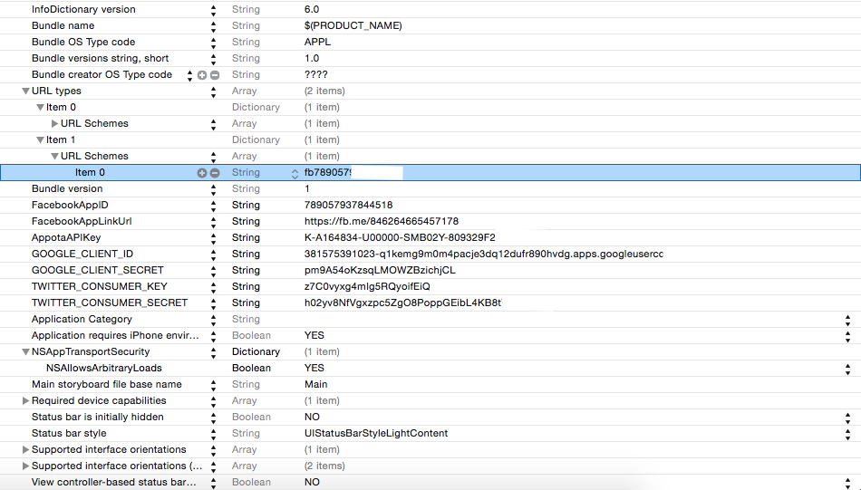

# Phiên bản  4 của Appta Game SDK dành cho iOS.

<b> Phiên bản 4 của Appota Game SDK cho iOS tích hợp facebook iOS sdk version 4.2 đã được triển khai và đang trong chế độ Developer Preview(Bản duyệt trước).[Ngoài ra, có thêm phiên bản 4 của Appota Game SDK tích hợp facebook ios sdk version 3](https://github.com/appota/ios-game-sdk/tree/facebooksdkv3) . Phiên bản 3 sẽ tiếp tục vẫn sẵn có tại repository [appota-ios-game-sdk3](https://github.com/appota/ios-game-sdk3).

##Highlights
* **Appota Login** – Hỗ trợ nhiều phương thức login: Appota, Google, Facebook, Twitter, Guest.
* **Appota Payment** – Hỗ trợ nhiều phương thức thanh toán : SMS, Card, E-Bank, Apple Payment.
* **Appota Analytics** – Một dịch vụ để thu thập, hình dùng, hiểu người dùng và dữ liệu của ứng dụng(session, active, error log ...).
* Hỗ trợ ***Push Notification*** cho nhiều nền tảng (iOS, Android, WindowPhone).

## Overview 
1. [Tích hợp SDK](#head1-integrate-sdk)
	* 1.1. [Yêu cầu ban đầu](#head2-prerequisites)
	* 1.2. [Nhận app api key và client key](#head2-obtain-app-api-key-and-client-key)
	* 1.3. [Cấu hình Xcode Project của bạn](#head2-configure-your-xcode-project) 
	* 1.4. [Update version mới hơn của SDK](#head2-update-the-sdk-to-a-newer-version)
2. [Các APIs phía Client](#head1-client-api)
 	* 2.1 [Khởi tạo và cấu hình SDK](#head2-init-sdk)
 	* 2.2 [Các hàm cho user](#head2-user-function)
 	* 2.3[Các hàm thanh toán](#head2-payment-function)
 	* 2.4 [Các hàm phân tích, thống kê](#head2-analytic-function)
 	* 2.5 [Các hàm liên quan tới Push Notification](#head2-push-notification-function)
 	* 2.6 [Hàm cài đặt Nhân vật trong game](#head2-set-game-character)
 	* 2.7 [Các hàm khác](#head2-advance-function)
3. [Tài liệu các lớp liên quan](#head1-class-document)
4. [FAQ and Glossary](#head1-faq)

##1. Tích hợp SDK <a name = "head1-integrate-sdk"> </a>
Project mẫu [sample apps](Sample/) là project đã có set up sẵn cho bạn. Bạn cũng có thể tích hợp SDK iOS với một dứng dụng đã tồn tại.

###1.1 Một vài yêu cầu sơ khai <a name = "head2-prerequisites"> </a>
Để bắt đầu với Appota Game SDK cho iOS, bạn có thể cài đặt SDK và bắt đầu với một project mới, hoặc bạn có thể tích hợp SDK với một project có sẵn. Bạn cũng có thể chạy ví dụ để hiểu rõ SDK hoạt động như thế nào.
Appota Game SDK cho iOS hỗ trợ những phiên bản phần mềm sau:
* Xcode 6 và những phiển bản mới hơn.
* iOS 6 và những phiển bản mới hơn.
###1.2. Nhận app api key và client key.<a name = ""head2-obtain-app-api-key-and-client-key"> </a>
* Truy xuất Appota app information `ClientKey`, `APIKey`, `ClientSecret` từ app dashboard <a name="head3-appota-appid"> </a>. Nếu bạn chưa đăng ký ứng dụng của bạn với Appota bằng cách tạo một ứng dụng Appota. Bạn phải [tạo một ứng dụng mới](https://developer.appota.com/beta/):
* Nhận Facebook Application ID <a name = "head3-facebook-appid"> </a>. [Cụ thể về cách làm sao để tạo, nhận và cài đặt Facebook app info cho iOS tham khảo tại đây](https://developers.facebook.com/docs/ios/getting-started).
*  Nhận Facebook App Link <a name = "head3-facebook-app-link"> </a>. [Cụ thể về cách làm sao để tạo Facebook app link cho iOS tham khảo tại đây](https://developers.facebook.com/docs/app-invites/ios) -> [App Link Tool](https://developers.facebook.com/quickstarts/?platform=app-links-host).
* Nhận Google Client ID và Client Secret <a name = "head3-google-appid"> </a>. [Cụ thể về cách làm sao để tạo, nhận và cài đặt Google app cho iOS tham khảo tại đây](https://developers.google.com/+/mobile/ios/getting-started).
* Nhận Twitter Consumer Key và Twitter Consumer Secret Key <a name= "head3-twitter-appid"> </a>. [Cụ thể về việc tạo, nhận và cài đặt Twitter app cho iOS tham khảo tại đây](https://apps.twitter.com/).

###1.3. Cấu hình XCode Project của bạn <a name="head2-configure-your-xcode-project"> </a>

####1.3.1. Thêm vào Xcode Project của bạn Appota iOS SDK.
Mở [ios-game-sdk/Frameworks](Frameworks/) và thêm [AppotaSDK.framework](Frameworks/AppotaSDK.framework), [AppotaBundle.bundle](Frameworks/AppotaBundle.bundle), [FBSDKCoreKit.framework](Frameworks/FBSDKCoreKit.framework),
[FBSDKLoginKit.framework](Frameworks/FBSDKLoginKit.framework),
[FBSDKShareKit.framework](Frameworks/FBSDKShareKit.framework)  vào project của bạn. (Chú ý chọn **Create groups for any added folders** và chọn **Copy items into destination group's folder (if needed)**)


####1.3.2. Thêm các framework phụ thuộc và cài đặt.

Chọn project của bạn từ Project Navigator, và chọn tiếp Target của ứng dụng của bạn.
Mở **Build Phases** tab, trong mục **Link Binary with Libraries**, thêm vào các framework sau:

- `StoreKit.framework`  
- `Accounts.framework`  
- `Social.framework`  
- `Twitter.framework`
- `ImageIO.framework`
- `CoreTelephony.framework`
- `AdSupport.framework`
- `SystemConfiguration.framework`
- `MessageUI.framework`
- `CoreMotion.framework`
- `Security.framework`

Mở **Build Settings**, tìm **Other Linker Flags**, thêm vào cờ `-ObjC` sau đó kiểm tra nếu **Link Frameworks Automatically**, **Enable Modules (C and Objectivce-C))** đều set là `YES`.

####1.3.3. Cấu hình file Info `.plist`
- Mở Info `plist` thêm vào `FacebookAppID` key với value là [Facebook AppID](#head3-facebook-appid) của bạn.
- Mở Info `plist` thêm vào `FacebookAppLinkUrl` key với value là [Facebook App Link](#head3-facebook-app-link) của bạn.
- Mở Info `plist` thêm vào `GOOGLE_CLIENT_ID` và `GOOGLE_CLIENT_SECRET` key với value là [Google Client Id and Sceret](#head3-google-appid) của bạn.
- Mở Info `plist` thêm vào `TWITTER_CONSUMER_KEY` and `TWITTER_CONSUMER_SECRET` key với value là [Twitter consumer key and twitter consumer secret](#head3-twitter-appid) của bạn.
- Mở Info `plist` thêm vào `AppotaAPIKey` key với value là [Appota APIKey](#head3-appota-appid) của bạn.
- Thêm url schemes:
	- Identifier Facebook, URL Schemes: `fbYOUR_FACEOOK_APP_ID`, [Facebook AppID](#head3-facebook-appid) có thể nhận được từ Facebook App Dashboard.
	
Một file `.plist` hoàn thành có thể trong như thế này hoặc bạn có thể xem ở [sample apps](Sample/) cho việc cấu hình plist 

####1.4. Update version mới hơn của SDK <a name="head2-update-the-sdk-to-a-newer-version"> </a>

Khi chúng tôi release một version mới của SDK, bạn có thể nhận các thay đổi theo miêu tả dưới đây.

* Trong Xcode chọn các framework, bundle sau đây và gõ **delete** trên bàn phím của bạn. Sau đó chọn **Move to Trash**:
 	* `ApppotaFramework.framework`
 	* `AppotaBundle.bundle`
    * `FBSDKCoreKit.framework`
    * `FBSDKLoginKit.framework`
    * `FBSDKShareKit.framework` 

* Làm theo quá trình cài đặt [ở trên](#head1-integrate-sdk) để include version mới của SDK.

##2. Các APIs phía Client <a name="head1-client-api"> </a>

###2.1 Khởi tạo và cấu hình SDK <a name = "head2-init-sdk"> </a>

Các class và function liên quan:

[AppotaGameSDK class - hàm khởi tạo](class-document/AppotaGameSDK-class.md#init-function)  

Appota SDK khởi tạo phải được gọi một lần khi khi ứng dụng bắt đầu chạy qua [AppotaGameSDK](class-document/AppotaGameSDK-class.md) class gọi `[AppotaGameSDK configure]` hầu hết các trường hợp nó được gọi trong phương thức `AppDelegate's` `application:didFinishLaunchingWithOptions:`  
trong file `AppDelegate.h` thêm import `#import <AppotaSDK/AppotaSDK.h>` sử dụng `AppDelegate` như là protocol:

```
@interface AppDelegate : UIResponder <UIApplicationDelegate, AppotaGameSDKCallback>
```

Trong `AppDelegate.m`:

```
- (BOOL)application:(UIApplication *)application didFinishLaunchingWithOptions:(NSDictionary *)launchOptions
{		
	// Your code is placed above
	[AppotaGameSDK configure];
 	[AppotaGameSDK sharedInstance].delegate = self;	
 }
```
Thêm handle open URL trong function: `application:openURL:sourceApplication:annotation:`

```
- (BOOL) application:(UIApplication *)application openURL:(NSURL *)url sourceApplication:(NSString *)sourceApplication annotation:(id)annotation {
    return [AppotaGameSDK  application:application handleOpenURL:url sourceApplication:sourceApplication annotation:annotation];
}
```
Có 4 function để control SDK follow:

- `setKeepLoginSession:(BOOL)` <a name="set-keep-login-session"> </a> function này sẽ control Appota Login Session sẽ được giữ lại hay bị xoá bỏ khi app chạy (khi xoá bỏ Login Session user phải login lại khi app bắt đầu chạy).

	**Chú ý** :Nếu function này không được gọi, mặc định Login session sẽ được giữ lại.
	
------
- `setAutoShowLoginDialog:(BOOL)` <a name="set-auto-show-login-dialog"> </a> function này sẽ control Appota Login View tự động show khi app chạy (Khi user chưa đăng nhập) hoặc bạn phải gọi hàm [[AppotaGameSDK showLoginView]](#show-login-view) để show Login View.

  **Chú ý** :Nếu function này không được gọi, mặc định Login View sẽ tự động show khi app chạy (Khi user chưa đăng nhập).
  
-----
  
- `setSDKButtonVisibility:(BOOL)` <a name = "set-sdk-button-visible"> </a> gọi function này khi bạn muốn SDK floating button ẩn hay hiện.

  **Chú ý** :Nếu hàm này không được gọi, mặc định SDK Button sẽ show khi app chạy.

-----

- `setHideWelcomeView:(BOOL)` <a name = "set-hide-wellcome-view"> </a> gọi function này khi bạn muốn ẩn hoặc hiện Wellcome View.

  **Chú ý** nếu function này không được gọi, mặc định Wellcome View sẽ tự động show khi app chạy.
  
###2.2. Các function liên quan tới user <a name="head2-user-function"> </a> 

Class và function liên quan:

- [AppotaGameSDK- user function](class-document/AppotaGameSDK-class.md#user-function)
- [AppotaUserLoginResult](class-document/AppotaUserLoginResult-class.md)

Khi bạn đã thực thi hàm khởi tạo SDK, hãy bắt đầu sử dụng tính năng login.

####2.2.1. Show login view <a name = "head2-show-login-view"> </a>

Như đã nói ở trên Login Dialog có thể control bởi function [[AppotaGameSDK sharedInstance] setAutoShowLoginDialog:](#set-auto-show-login-dialog). Nếu bạn không muốn Login View show tự động, bạn có thể gọi một cách thủ công hàm `showLoginView` khi bạn cần:

- **Show Login View**

```
[AppotaGameSDK showLoginView];
```
<a name="show-login-view"> </a>

Appota Login Dialog chứa 5 phương thức authorization : 
**Facebook**, **Google**, **Twitter**, **Appota User** and **Quick Login** 


Theo sau cơ chế này cho chức năng đăng nhập, hãy implement [`didLoginSuccess`](#did-login-succeed) callback để xác nhận bạn đã đăng nhập thành công:


####2.2.2. Show Register view 

```
[AppotaGameSDK showRegisterView];
```
Gọi hàm này khi muốn show register view.

####2.2.3. Logout

```
[AppotaGameSDK logOut];
```
Gọi hàm trên khi muốn log out.

####2.2.4. Switch account

Gọi hàm này khi user đã login sẽ show một Login View and cho phép login vào tài khoản khác. Khi switch account thành công `didLoginSuccess` callback sẽ được gọi lại, vì vậy hãy đăng xuất tài khoản game của bạn và xác nhận lại với tài khoản đã switch mới.

```
[AppotaGameSDK switchAccount];
```


####2.2.5. Show User Info

Gọi hàm này sẽ show user info view.

```
[AppotaGameSDK showUserInfoView];
```
####2.2.6. Check user login

Hàm này sẽ trả về trạng thái user đã đăng nhập hay chưa. Trả về YES nếu user đã đăng nhập, trả về NO nếu user chưa đăng nhập.

```
[AppotaGameSDK isUserLoggedIn];
```
####2.2.7. Get Logged in user info

trả về AppotaUserLoginresult (trả về `nil` nếu user chưa đăng nhập)

```
[AppotaGameSDK getUserInfo];
```
####2.2.8. Show history of transaction

Hàm này sẽ show lên lịch sử các giao dịch user đã thực hiện (khi user đã đăng nhập).

```
[AppotaGameSDK showTransactionHistory];
```
####2.2.9. Handle authenticaiton callbacks <a name = "login-handle-login-response"> </a>

AppotaSDK cung cấp 4 callbacks delegate cho login được định nghĩa trong [`AppotaGameSDKCallback`](class-document/AppotaGameSDKCallback-class.md) , hãy implement các fuction này trong `Appdelegate.m`

**Note** 2 callbacks là `@required` : `@required` và `@required`.

-----
**Login succeed callback** <a name = "did-login-succeed"> </a>

- Nhận Appota user info từ `AppotaUserLoginResult` sau đó post lên sever của bạn để verify và tạo game user. Cụ thể hơn về việc tích hợp user trên sever [Tích hợp user](https://github.com/appota/ios-game-sdk/wiki/Integrate-user-system)

- **Chú ý** :Nhớ xác nhận Appota UserID, UserName và Access token trên server của bạn trước khi tiến hành tích hợp game user.

```
- (void) didLoginSuccess:(AppotaUserLoginResult*) userLoginResult
```
|Tham số|Miêu tả|  
|-------|-----------|  
|userLoginResult|`userLoginResult` là [AppotaUserLoginResult](class-document/AppotaUserLoginResult-class.md) object chứa user information (username, user_id, access token)|

------
**Login fail callback**

- Callback khi đăng nhập gặp vấn đề.

```
- (void) didLoginErrorWithMessage:(NSString *)message withError:(NSError *)error;
```
|Tham số|Miêu tả|  
|-------|-----------|  
|message|`message`: là message thông báo lỗi|
|error|`error` : lỗi|

----
**Logout callback**  

- Callback sau khi user đăng xuất với  user name

```
- (void) didLogout:(NSString*) userName
```

|Tham số|Miêu tả|  
|-------|-----------|  
|userName|`userName` là user name đăng xuất|

----
**Close login view callback**  

- Callback khi user đóng login view trong quá trình ứng dụng chạy.

```
- (void) didCloseLoginView;
```
###2.3. Các hàm liên quan tới thanh toán <a name="head2-payment-function"> </a>

Các Class và function liên quan :

- [AppotaGameSDK - payment function](class-document/AppotaGameSDK-class.md#payment-function)
- [AppotaGameSDKCallback](class-document/AppotaGameSDKCallback-class.md)
- [AppotaPaymentResult](class-document/AppotaPaymentResult-class.md)

Do sử dụng tính năng thanh toán của Appota SDK bạn phải hiểu cơ chế thanh toán của Appota và cấu hình. Hãy tham khảo cơ chế thanh toán tại [Appota Payment Document](https://github.com/appota/ios-game-sdk/wiki/Passive-Confirmation-via-IPN) và và cấu hình thanh toán tại [Appota Developer Portal](https://developer.appota.com/beta/).

####2.3.1. Hiển thị payment view <a name="head3-show-payment-view"> </a>

-----
Bạn có 3 phương thức để show payment view. Mỗi payment view biểu diễn một hoặc một list các payment package. Mỗi package chứa thông tin của game coin, amount hay package trong game. 

**Show default list payment view**

Bạn có thể show payment view với list payment packages mặc định (list này được configured trên [Appota Developer Portal](https://developer.appota.com/beta/) )

```
[AppotaGameSDK showPaymentView]
```


####2.3.2. Hiển thị payment view với một package được chỉ định 

Bạn có thể show payment view với một package được chỉ định phụ thuộc vào cơ chế trong game của bạn

```
[AppotaGameSDK showPaymentViewWithPackageID:];
```


####2.3.3. Hiển thị payment view từ SDK button 


####2.3.4. Close payment View

Bạn có thể close payment view bằng cách sử dụng hàm sau:

```
[AppotaGameSDK closePaymentView];
```
####2.3.5 Xử lý payment callback <a name="head3-handle-payment-callback"> </a>

---------
Mọi thanh toán thành công callback trong `AppotaGameSDK` delegate (cài đặt trong [init function](#head2-init-sdk)).  Các hàm callback  phải đặt trọng `AppDelegate.m`. Có 1 hàm callback `@required`  được định nghĩa trong [AppotaGameSDKCallback](class-document/AppotaGameSDKCallback-class.md)


**Callback khi thanh toán thành công**

Tuỳ thuộc vào cơ chế thanh toán (APN or IPN, hãy tham khảo thêm tại [Appota Payment](https://github.com/appota/ios-game-sdk/wiki/Integrate-payment-system), tiến hành xác thực thanh toán hoặc thông báo thanh toán thành công cho user

```
- (void) didPaymentSuccessWithResult:(AppotaPaymentResult*) paymentResult withPackage:(NSString *) packageID;
```
|Tham số|Miêu tả|  
|-------|-----------|  
|`paymentResult`|`paymentResult` is [AppotaPaymentResult](class-document/AppotaPaymentResult-class.md) đối tượng chưa thông tin thanh toán (transaction id, amount, ...)|
|`packageID`|`packageID` là id của package đã được thanh toán, `packageID` được định nghĩa trong quá trình cấu hình thanh toán|

----
**Callback khi payment có lỗi**

```
- (void) didPaymentErrorWithMessage:(NSString *)message withError:(NSError *)error;
```

|Tham số|Miêu tả|  
|-------|-----------|  
|`message`|`message` is message of error|
|`error`|`error` the error payment problems|


----
**Callback cho payment state**

**PAYMENT_STATE** được yêu cầu SDK của chúng tôi để tạo một thanh toán đúng với package. Tuỳ thuộc vào payment package của bạn ,implement hàm này và trả về một payment state đúng. [Tìm hiểu thêm về Payment state](#head3-payment-state).  

Ví dụ packageID: com.gold.package1 - (được định nghĩa trên trang developer ) tương ứng với một package của 1000 gold và user game hiện tại là X đang chơi trong server Y. Theo đó payment state có thể có dạng : 1000_gold_X_Y (Phụ thuộc vào định dạng của bạn).

**Chú ý** :Độ dài của **PAYMENT_STATE** không được vượt quá 150 ký tự.

```
- (NSString*) getPaymentStateWithPackageID:(NSString *) packageID;
```
|Tham số|Miêu tả|  
|-------|-----------|  
|`packageID`|`packageID` là package đã được thanh toán, `packageID` được định nghĩa trong quá trình cấu hình thanh toán|

###2.4. Các hàm phân tích <a name="head2-analytic-function"> </a>

Appota SDK hỗ trợ gọi track cho view và event. Những thông tin track này rất hữu dụng cho quảng cáo game và tracking.

**Hàm tracking View**  
khi bạn vào một view gửi view đó cho tracking

```
+ (void) sendViewWithName:(NSString*) viewName;
```
**Hàm tracking event**  
Khi user thực thi một event gửi event đó cho tracking

```
+ (void) sendEventWithCategory:(NSString*) categoryName withEventAction:(NSString*) action withLabel:(NSString*) label withValue:(NSNumber*) value;
```
định nghĩa `category`, `action`, `label` cụ thể of một hành động (action)


Khi user thực thi một event gửi event đó cho tracking

```
+ (void)sendEventWithCategory:(NSString *)categoryName withEventAction:(NSString *)action withLabel:(NSString *)label;
```
định nghĩa `category`, `action`, `label` cụ thể of một hành động (action)

###2.5. Các hàm Push notification <a name="head2-push-notification-function"> </a>

**Đăng ký push notification với một groupname**  
Đăng ký push notification sử dụng group name để chọn user group (ví dụ chỉ push duy nhất user trong server 1 khi group name = "server 1").

```
+ (void) registerPushNotificationWithGroupName:(NSString*) groupName;
```
**Cấu hình push notification với dữ liệu**

```
+ (NSString*) configurePushNotificationWithTokenData:(NSData*) deviceTokenData;
```  
cấu hình push notification với dữ liệu được gọi sau khi user đăng ký push notification. Bạn cho hàm này vào hàm :

```
- (void)application:(UIApplication*)application didRegisterForRemoteNotificationsWithDeviceToken:(NSData*)deviceToken
{
    [AppotaGameSDK configurePushNotificationWithTokenData:deviceToken];
}
```
của application delegate của bạn (thường là trong file AppDelegate.m).

**Xử lý push notification**

```
+ (void) handlePushNotification:(NSDictionary *)receiveDictionary;
``` 
You bạn cho hàm này vào hàm :

```
- (void)application:(UIApplication *)application didReceiveRemoteNotification:(NSDictionary *)userInfo{
    [AppotaGameSDK handlePushNotification:userInfo];
}
```
của application delegate (thường là trong file AppDelegate.m).


###2.6. Set nhận vật trong game <a name="head2-set-game-character"> </a>

Sử dụng hàm này khi bạn muốn set nhân vật trong game  với các tham số truyền vào:
server name, server ID , character name, character ID.

```
+ (void) setCharacterWithCharacterName:(NSString *)characterName characterID:(NSString *)characterID
               serverName:(NSString *)serverName serverID:(NSString *)serverID
          onCompleteBlock:(AppotaSDKDictionaryBlock ) completeBlock
             onErrorBlock:(AppotaSDKErrorBlock ) errorBlock;
```             

###2.7. Các hàm khác <a name="head2-advance-function"> </a>

Tất cả các hàm cần dùng khác đều nằm ở [AppotaGameSDK+Advance-Class](class-document/AppotaGameSDK+Advance-Class.md).

**Mời bạn trên facebook tham gia chơi game**

Gọi [AppotaGameSDK inviteFacebookFriendsWithCompleteBlock:andErorrBlock:]; để mời bạn của bạn tham gia chơi game cùng bạn
(user phải login mới sử dụng được tính năng này).

```
+ (void)inviteFacebookFriendsWithCompleteBlock:(AppotaSDKDictionaryBlock) resultBlock
                                 andErorrBlock:(AppotaSDKErrorBlock) errorBlock;
```

**Hiển thị Facebook Login**

Gọi [AppotaGameSDK showFacebookLogin]; để show Facebook Login không có Appota Login UI.

```
+ (void) showFacebookLogin;
```

**Hiển thị Google Login**

Gọi [AppotaGameSDK showGoogleLogin]; để show Google Login không có Appota Login UI.

```
+ (void) showGoogleLogin;
```

**Hiển thị Twitter Login**

Gọi [AppotaGameSDK showTwitterLogin]; để show Twitter Login không có Appota Login UI.

```
+ (void) showTwitterLogin;
```

##3. Tài liệu về các  Class liên quan  <a name="head1-class-document"> </a>
- [AppotaGameSDK-class](class-document/AppotaGameSDK-class.md)
- [AppotaGameSDKCallback-class](class-document/AppotaGameSDKCallback-class.md)
- [AppotaUserLoginResult-class](class-document/AppotaUserLoginResult-class.md)
- [AppotaPaymentResult](class-document/AppotaPaymentResult-class.md)
- [AppotaGameSDK+Advance-Class](class-document/AppotaGameSDK+Advance-Class.md)

##4. FAQ and Glossary <a name="head1-faq"></a>
- `IPN` là cơ chế thanh toán được Appota sử dụng để cộng gold cho game user. Cụ thể tham khảo tại [IPN](https://github.com/appota/ios-game-sdk/wiki/Passive-Confirmation-via-IPN)
- `PackageID` mỗi một payment package trong game có thể được định nghĩa gắn với nó một package ID (được cung cấp SDKTool) để định danh package.
- `PaymentState` <a name = "head3-payment-state"> </a> payment state phải được thực thi trong  hàm `getPaymentStateWithPackageID:`. Và sử dụng `PackageID` và thông tin game server để tạo nên `PaymentState`.   
Ví dụ packageID: `com.gold.package1` - (được định nghĩa trong quá trình tạo payment config) tương ứng với một package của 1000 gold và game user hiện tại là X đang chơi trong server Y. Khi đó payment state sẽ có cấu trúc như sau : com.gold.package1_1000_gold_X_Y (tuỳ thuộc vào định dạng của bạn).

