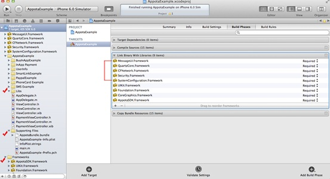
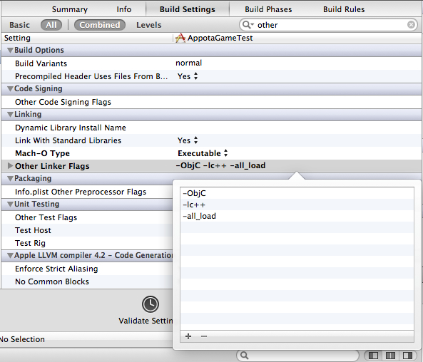

**Get Started**

Appota Game SDK is the simplest way to integrate user and payment for
your game in Appota system. This SDK provides solutions for payment
methods such as: SMS, Card. Internet Banking, Paypal and Apple Payment.

**Steps to integrate SDK:**

​1. Setup Appota SDK

​2. Config SDK

​3. Integrate SDK

-------------------------------

**1. Setup Appota SDK**

**Import Appota.framework into project**

Drag and drop AppotaSDK.framework and AppotaBundle.bundle into your project.

Tick on checkbox: “Copy items into destination group's folder (if needed)”.

In Project app’s target settings section, find [Build phases] and open
Link Binary with Libraries. Click on ‘+’ button and add these frameworks:

```
AppotaSDK, CoreText, StoreKit, AudioToolBox, MobileCoreServices, AVFoudation, CoreVideo,
MessageUI, Security, SystemConfiguration, CFNetwork, OpenGLES, CoreMedia, libxml2.dylib, libsqlite3.dylib
```



In project build settings section, find Other Linker Flags, add these linker flags: -ObjC, -lc++ và -all_load.



Import header file to source file where do you want to use SDK:

``` objective-c
#import <AppotaSDK/AppotaSDK.h>
```

**Config plist with CLIENT_KEY**

Add 1 string AppotaClientId with the value is CLIENT_ID (details about CLIENT_ID are in section of getting ACCESS_TOKEN)

Add more schema: Add 1 string URL Array types. Create 1 item more with URL Schemes is appotaCLIENT_ID.

For example: If CLIENT_ID = b804d6421df6ae7dbcd51469e4d8ee0005101f540,
schemes will be appotab804d6421df6ae7dbcd51469e4d8ee0005101f540.


**2. Config SDK**

**Config SDK in Appdelegate:**

Setup SDK in Appdelegate:
- AppDelegate.h
- Add protocol *AppotaGameSDKConfigureDelegate* to AppDelegate
- AppDelegate.m			
Config AppotaGameSDK after setting up windows in Appdelegate (Reference *AppotaGameTest/AppDelegate.m*) by AppotaGameSDKConfigure class
	* Init payment list (*AppotaPayment* class represents payment item)
	* Init AppotaGameSDKConfigure with 
		* CLIENT_ID - Config con dev.appota.com if app is not in published state please use SANDBOX_CLIENT_ID instead
		* CLIENT_SECRET - Config con dev.appota.com if app is not in published state please use SANDBOX_CLIENT_SECRET instead
		* INAPP_API_KEY - Config con dev.appota.com if app is not in published state please use SANDBOX_INAPP_API_KEY instead
		* noticeUrl - URL for payment notification
		* checkUpdate option - Enable this option for automatic update by AppotaGameSDK
		* show payment button optition:
			- YES: Enable this option for automatic show a payment button floating on game screen
			- NO: Don't show the floating payment button (Payment view can be shown via function [AppotaGameSDKConfigre showPaymentView])
		* Social login can be configured via boolean value enableFacebookLogin, googleLogin, twitterLogin
	* Sample:
	
	``` objective-c
	    [AppotaGameSDKConfigure configureWithClientID:CLIENT_ID
                                 withClientSecret:CLIENT_SECRET
                                  withInAppAPIKey:INAPP_API_KEY
                         withNoticeUrl:@"http://filestore9.com/test.php"
                                  withCheckUpdate:YES
                              enableFacebookLogin:YES
                                enableGoogleLogin:YES
                               enableTwitterLogin:YES
                            autoShowPaymentButton:YES
	     ];
	```
To integrate Google, FB and Twitter login please follow instruction for each SDK. For FBSDK please config Info.plist and FacebookAppID, for GoogleSDK please config googleClientId (Reference AppotaGameTest)
	* Set delegate for AppotaGameSDKConfigure (shoul use AppDelegate for delegate)
	* Handle login status by protocol function *- (void) didFinishLogin:(NSDictionary \*)userInfoDict* (UserInfo dict can be used for verification process)
	* If you are using Social Login please add handle open URL in your AppDelegate by this function :
	
	``` objective-c
	(BOOL) application:(UIApplication *)application openURL:(NSURL *)url sourceApplication:(NSString *)sourceApplication annotation:(id)annotation {
    		return [AppotaGameSDKConfigure handleOpenURL:url sourceApplication:sourceApplication annotation:annotation];
	}
	```
Config jsonConfigUrl (for remote updating feature like: promotion, login setting, …) by setting *[AppotaGameSDKConfigure sharedGameConfig].jsonConfigUrl

**3. Integrate SDK**

Each payment is an instance of class AppotaPayment. You can create a payment by
	
``` objective-c
AppotaPayment *p0 = [[AppotaPayment alloc]     initWithPaymentMethod:PAYMENT_SMS    
   withAmount:15000 
   withCoinAmount:1000 
   withCurrency:@"VND" 
   withCoinName:@"Gold" 
   withCoinImage:nil    
   withPaymentDescription:@"500 vnd free"];    	
```
    	       	       
- With PAYMENT_SMS is the payment method (can use PAYMENT_CARD as phone card, PAYMENT_INTERNET_BANKING (PAYMENT_BAOKIM) as bank, PAYMENT_PAYPAL, PAYMENT_APPLE as well)		
	* 15000 is amount of money for that method
	* 1000 is coin amount in game corresponding money amount above
	* "VND" is currency of the payment
	* "Gold" is detail coin name in your game, it depends on the your game - can be nil
	* coinImage is UIImage can be nil, if it's not nil it'll show in payment part for more detail
	* payment description is description to describe that item
	
	* Add payment support by *addSupportPayment* function:
	```
	    [AppotaGameSDKConfigure addSupportPayment:p0];		
	```

- Support function: Every function will be accessed via AppotaGameSDKConfigure class
	* +showSDKView: Manualy show SDK view ( with payment and account button) from your game, can be implemented your button click
	* +logOut: Manualy show logout popup in your game
	* +(NSDictionary): getUserInfo* Return userinfo (acces_token, username, email, …) in NSDictionary
	* +showPaymentView: Manualy show payment view from your game, can be implemented your button click
	* +showLoginView: Manualy show login view from your game, can be implemented your button click
	* +showSwitchUserView: Manualy show switchuser view from your game, can be implemented your button click	
	* showPaymentButton, hidePaymentButton: Show and hide floating button of AppotaSDK in your game
	* +sharedGameConfig: Singleton shared instance of AppotaGameSDKConfigure