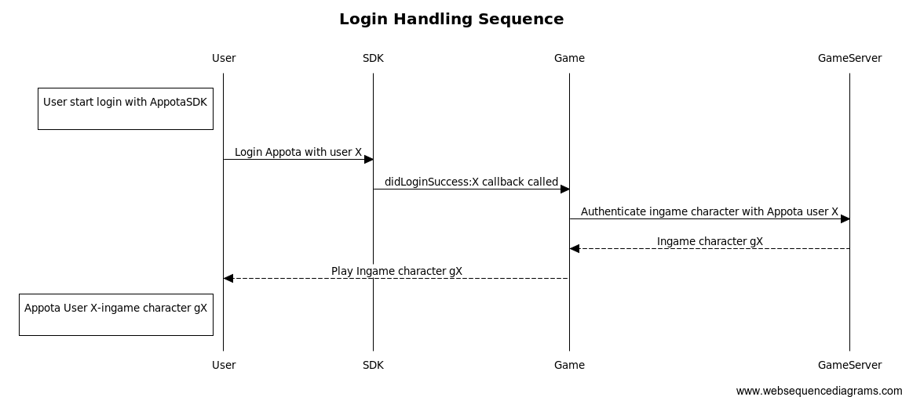
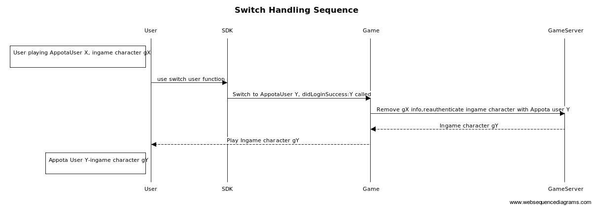
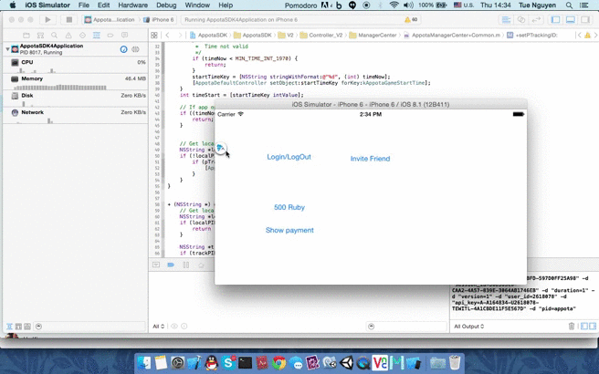

#Version 4 of the Appta Game SDK for iOS

<b> Version 4 of the Appota Game for iOS integrate facebook iOS SDK version 4.2 has been published in this reposity and in Developer Preview.[In addition, We have Appota SDK 4 which integerate Facebok iOS SDK version 3](https://github.com/appota/ios-game-sdk/tree/facebooksdkv3). Version 3 will continue to be available in our [appota-ios-game-sdk3](https://github.com/appota/ios-game-sdk3) repository. </b>


##Highlights

* **Appota Login** – Support multiple login methods Appota, Google, Facebook, Twitter, Guest.
* **Appota Payment** – Support mutiple payment methos SMS, Card, E-Bank, Apple Payment.
* **Appota Analytics** – A service for collecting, visualizing, and understanding users and application's data (session, active, error log, ...). 
* Support **Push Notification** on multiple platforms (iOS, Android, WP).

## Overview
1. [Integrate SDK](#head1-integrate-sdk)
	* 1.1 [Prerequisites](#head2-prerequisites)
	* 1.2 [Obtain app api key and client key](#head2-obtain-app-api-key-and-client-key)
	* 1.3 [Configure your XCode Project](#head2-configure-your-xcode-project)
	* 1.4 [Update the SDK to a Newer Version](#head2-update-the-sdk-to-a-newer-version)
2. [Client API](#head1-client-api)
    * 2.1 [Init and configure SDK](#head2-init-sdk)
    * 2.2 [User function](#head2-user-function)
    * 2.3 [Payment function](#head2-payment-function)
    * 2.4 [Analytic function](#head2-analytic-function)
    * 2.5 [Push notification function](#head2-push-notification-function)
    * 2.6 [Set game character function](#head2-set-game-character)
    * 2.7 [Advance function](#head2-advance-function)
3. [Class document](#head1-class-document)
4. [FAQ and Glossary](#head1-faq)

##1. Integrate SDK <a name = "head1-integrate-sdk"> </a>
The [sample apps](Sample/) are standalone projects that are already set up for you. You can also integrate the SDK for iOS with an existing application.

###1.1. Prerequisites <a name = "head2-prerequisites">  </a>
To get started with the Appota Game SDK for iOS, you can set up the SDK and start building a new project, or you can integrate the SDK in an existing project. You can also run the samples to get a sense of how the SDK works.

The Appota Game SDK for iOS supports the following versions of software:

* Xcode 6 and later
* iOS 6 and later

###1.2. Obtain app api key and client key <a name="head2-obtain-app-api-key-and-client-key"> </a>
* Retreive Appota app information `ClientKey`, `APIKey`, `ClientSecret` from app dashboard. <a name="head3-appota-appid"> </a> If you haven't already registered your app with Appota by creating a Appota app, you should [create a new app](https://developer.appota.com/beta/):  
* Retreive Facebook Application ID. <a name="head3-facebook-appid"> </a> [Detail about how to create ,retreive and setup Facebook app info for iOS](https://developers.facebook.com/docs/ios/getting-started).
* Create Facebook App Link. <a name = "head3-facebook-app-link"> </a> [App Link Tool](https://developers.facebook.com/quickstarts/?platform=app-links-host)
* Retreive Google Client ID and Client Secret. <a name="head3-google-appid"> </a> [Detail about create, retreive and setup Google app for iOS](https://developers.google.com/+/mobile/ios/getting-started)
* Retreive Twitter Consumer Key and Twitter Consumer Secret Key. <a name= "head3-twitter-appid"> </a> [Detail about create, retreive and setup Twitter app for iOS](https://apps.twitter.com/)

###1.3. Configure your XCode Project <a name="head2-configure-your-xcode-project"> </a>

####1.3.1. Add the Appota iOS SDK
 Open [ios-game-sdk/Frameworks](Frameworks/)  and add  [AppotaSDK.framework](Frameworks/AppotaSDK.framework), [AppotaBundle.bundle](Frameworks/AppotaBundle.bundle), [FBSDKCoreKit.framework](Frameworks/FBSDKCoreKit.framework),
 [FBSDKLoginKit.framework](Frameworks/FBSDKLoginKit.framework), 
[FBSDKShareKit.framework](Frameworks/FBSDKShareKit.framework) to your project. (Remember to choose **Create groups for any added folders** and select **Copy items into destination group's folder (if needed)**)


####1.3.2. Add framework dependencies and setting
Select your project from the Project Navigator, and choose your application's target.  
Open **Build Phases** tab, within **Link Binary with Libraries**, add the following frameworks:  

- `StoreKit.framework`  
- `Accounts.framework`  
- `Social.framework`  
- `Twitter.framework`
- `ImageIO.framework`
- `CoreTelephony.framework`
- `AdSupport.framework`
- `SystemConfiguration.framework`
- `MessageUI.framework`
- `CoreMotion.framework`
- `Security.framework`

Open **Build Settings**, find **Other Linker Flags**, add `-ObjC` then check if **Link Frameworks Automatically**, **Enable Modules (C and Objectivce-C))** are set to `YES`


####1.3.3. Configure the Info `.plist`

- Open Info `plist` section add `FacebookAppID` key with value is your [Facebook AppID](#head3-facebook-appid).
- Open Info `plist` section add `FacebookAppLinkUrl` key with value is your [Facebook App Link](#head3-facebook-app-link).
- Open Info `plist` section add `GOOGLE_CLIENT_ID` and `GOOGLE_CLIENT_SECRET` key with value is your [Google Client Id and Sceret](#head3-google-appid).
- Open Info `plist` section add `TWITTER_CONSUMER_KEY` and `TWITTER_CONSUMER_SECRET` key with value is your [Twitter consumer key and twitter consumer secret](#head3-twitter-appid).
- Open Info `plist` section add `AppotaAPIKey` key with value is your [Appota APIKey](#head3-appota-appid).
- Add url schemes:
	- Identifier Appota, URL Schemes: `appotaYOUR_CLIENT_KEY`, [Appota Client Key](#head3-appota-appid) can be retreived from developer portal
	- Identifier Facebook, URL Schemes: `fbYOUR_FACEOOK_APP_ID`, [Facebook AppID](#head3-facebook-appid) can be retreived from Facebook App Dashboard

The finished `.plist` should look like this or check the [sample apps](Sample/) for plist configuration


####1.4. Update the SDK to a Newer Version <a name="head2-update-the-sdk-to-a-newer-version"> </a>

When we release a new version of the SDK, you can pick up the changes as described below.

* In Xcode select the following frameworks, bundle and hit **delete** on your keyboard. Then select **Move to Trash**:

    * `ApppotaFramework.framework`
    * `AppotaBundle.bundle`
    * `FBSDKCoreKit.framework`
    * `FBSDKLoginKit.framework`
    * `FBSDKShareKit.framework`
    
* Follow the installation process [above](#head1-integrate-sdk) to include the new version of the SDK.


##2. Client APIs <a name="head1-client-api"> </a>

###2.1 Init and configure SDK <a name = "head2-init-sdk"> </a>
Related class and function:
[AppotaGameSDK class - init function](class-document/AppotaGameSDK-class.md#init-function)  
Appota SDK init must be called once when application start via [AppotaGameSDK](class-document/AppotaGameSDK-class.md) class call `[AppotaGameSDK configure]` so most of the time it will be placed in `AppDelegate's` method `application:didFinishLaunchingWithOptions:`  
In `AppDelegate.h` add import `#import <AppotaSDK/AppotaSDK.h>` use `AppDelegate` as protocol:

```
@interface AppDelegate : UIResponder <UIApplicationDelegate, AppotaGameSDKCallback>
```

In `AppDelegate.m`:

```
- (BOOL)application:(UIApplication *)application didFinishLaunchingWithOptions:(NSDictionary *)launchOptions
{		
	// Your code is placed above
	[AppotaGameSDK configure];
 	[AppotaGameSDK sharedInstance].delegate = self;	
 }
```

Add handle open URL in function `application:openURL:sourceApplication:annotation:`

```
- (BOOL) application:(UIApplication *)application openURL:(NSURL *)url sourceApplication:(NSString *)sourceApplication annotation:(id)annotation {
    return [AppotaGameSDK  application:application handleOpenURL:url sourceApplication:sourceApplication annotation:annotation];
}
```
There are 4 functions to control SDK follow:

- `setKeepLoginSession:(BOOL)` <a name="set-keep-login-session"> </a> this function will control the Appota Login Session will be kept or deleted at app lauching (when deleted user has to login again when app start).   
**Note** If this function is not called, login session will be kept by default.
- `setAutoShowLoginDialog:(BOOL)` <a name="set-auto-show-login-dialog"> </a> this function will control the Appota Login View will be automatically show at app lauching (when user's not logged in) or you have to call [showLoginView](#show-login-view) function to show the LoginView. 
**Note** If this function is not called, login view will automatically show at app lauching (when user's not logged in).
- `setSDKButtonVisibility:(BOOL)` <a name = "set-sdk-button-visible"> </a> call this function to setting hide or show SDK floating button.
**Note** If this function is not called, the SDK floating button will automatically show at app lauching.

- `setHideWelcomeView:(BOOL)` <a name = "set-hide-wellcome-view"> </a> call this function to setting hide or show Wellcome View.
**Note** If this function is not called, the Wellcome View will automatically show at app lauching.

###2.2. User functions <a name="head2-user-function"> </a>
Related class and function:

- [AppotaGameSDK- user function](class-document/AppotaGameSDK-class.md#user-function)
- [AppotaUserLoginResult](class-document/AppotaUserLoginResult-class.md)


Once you've implemented init SDK function, start using login features.

####2.2.1. Show login view <a name = "head2-show-login-view"> </a>
As mentioned above login dialog flow can be control by function [setAutoShowLoginDialog:](#set-auto-show-login-dialog). Automatically show login view at app launching or manual call `showLoginView` when you need:  

- **Show Login View**

```
[AppotaGameSDK showLoginView];
```
<a name="show-login-view"> </a>
Appota Login Dialog contains 5 authorization methods: **Facebook**, **Google**, **Twitter**, **Appota User** and **Quick Login**  


Follow this mechanism for login function, please implement [`didLoginSuccess`](#did-login-succeed) callback to authenticate your in-game user.

####2.2.2. Show Register view 
- **Show Register View**

```
[AppotaGameSDK showRegisterView];
```
Call it when wanna show register view.


####2.2.3. Logout
- **Logout function**
 
```
[AppotaGameSDK logOut];
```
Call it when wanna log out. 

####2.2.4. Switch account
- **Switch account function**

Call this function when user logged in will show a login view and allow to login other account. When switch account succeed `didLoginSuccess` callback will be called again, so please logout your game account and reauthenticate with new switched account.

```
[AppotaGameSDK switchAccount];
```



####2.2.5. Show User Info
- **Show User Info function**

Call this function will show user info view  

```
[AppotaGameSDK showUserInfoView];
```

####2.2.6. Check user login
- **Check user login**

- This function will return user logged in state

```
[AppotaGameSDK isUserLoggedIn];
```
####2.2.7. Get Logged in user info
- **Get Logged in user info**
- 
Return AppotaUserLoginresult (`nil` if user not logged in)

```
[AppotaGameSDK getUserInfo];
```
####2.2.8. Show history of transaction
 
- **Show history of transaction**

 This function will show history of transaction of user (When user is logged in).

```
[AppotaGameSDK showTransactionHistory];
```

####2.2.9. Handle authenticaiton callbacks <a name = "login-handle-login-response"> </a>

AppotaSDK provide 4 callbacks delegate for login defined in [`AppotaGameSDKCallback`](class-document/AppotaGameSDKCallback-class.md) , please implement these functions to `Appdelegate.m`

**Note** 2 callbacks are  `@required` : `-didLoginSuccess:` and `-didLogOut:`

----
**Login succeed callback**  <a name = "did-login-succeed"> </a>

Retreive Appota user info from `AppotaUserLoginResult` then post to your server to verify and create game user. For more detail about user integration on server: [User Integration](https://github.com/appota/ios-game-sdk/wiki/Integrate-user-system)  

**Note** Remember verify Appota UserID, UserName and Access token on your server before procceeding game user integration

```
- (void) didLoginSuccess:(AppotaUserLoginResult*) userLoginResult
```
|Parameter|Description|  
|-------|-----------|  
|userLoginResult|`userLoginResult` is [AppotaUserLoginResult](class-document/AppotaUserLoginResult-class.md) object of user information (username, user_id, access token)|

----
**Login fail callback**  
Callback when login have problems

```
- (void) didLoginErrorWithMessage:(NSString *)message withError:(NSError *)error;
```

|Parameter|Description|  
|-------|-----------|  
|message|`message` is message error|
|error|`error` is error of login prblem|

----
**Logout callback**  
Callback after user logout with user name

```
- (void) didLogout:(NSString*) userName
```
|Parameter|Description|  
|-------|-----------|  
|userName|`userName` is user name logout|

----
**Close login view callback**  
Callback when user close login view at app launching

```
- (void) didCloseLoginView;
```

###2.3. Payment function <a name="head2-payment-function"> </a>

Related class and function:

- [AppotaGameSDK - payment function](class-document/AppotaGameSDK-class.md#payment-function)
- [AppotaGameSDKCallback](class-document/AppotaGameSDKCallback-class.md)
- [AppotaPaymentResult](class-document/AppotaPaymentResult-class.md)

Because using AppotaSDK payment function you should understand Appota Payment mechanism and configuration. Please study Appota payment mechanism at [Appota Payment Document](https://github.com/appota/ios-game-sdk/wiki) and payment configuration at [Appota Developer Portal](https://developer.appota.com/beta/).

####2.3.1. Show payment view <a name="head3-show-payment-view"> </a>

---------
You have 3 methods to show payment view. Each payment view represents one or list of payment package. Each package contains information of game coin amount or in-game package. 

**Show default list payment view**

You can show payment view with default list payment packages (which is configured on [Appota Developer Portal](https://developer.appota.com/beta/))

```
[AppotaGameSDK showPaymentView]
```


####2.3.2. Show payment view for a specific package 

You can show a specific package depends on your in-game mechanism

```
[AppotaGameSDK showPaymentViewWithPackageID:];
```


####2.3.3. Show payment view from SDK floating button 


####2.3.4. Close payment View
You can close payment view by use this function:

```
[AppotaGameSDK closePaymentView];
```

####2.3.5 Handle payment callback <a name="head3-handle-payment-callback"> </a>

---------
Every payment success will callback in `AppotaGameSDK` delegate (setup in [init function](#head2-init-sdk)). The callback functions should be in `AppDelegate.m`
There are 2 `@required` callback function defined in [AppotaGameSDKCallback](class-document/AppotaGameSDKCallback-class.md)

**Callback after a successful payment**

Depends on your payment machenism (APN or IPN, please readmore about [Appota Payment](https://github.com/appota/ios-game-sdk/wiki/Integrate-payment-system), proceed payment verification or alert payment succeed for user

```
- (void) didPaymentSuccessWithResult:(AppotaPaymentResult*) paymentResult withPackage:(NSString *) packageID;
```

|Parameter|Description|  
|-------|-----------|  
|`paymentResult`|`paymentResult` is [AppotaPaymentResult](class-document/AppotaPaymentResult-class.md) object of payment information (transaction id, amount, ...)|
|`packageID`|`packageID` is id of the package has been bought, `packageID` is defined during payment configuration process|

----
**Callback when payment have problems**

```
- (void) didPaymentErrorWithMessage:(NSString *)message withError:(NSError *)error;
```

|Parameter|Description|  
|-------|-----------|  
|`message`|`message` is message of error|
|`error`|`error` the error payment problems|

----
**Callback for payment state**

**PAYMENT_STATE** is required for our SDK to make correct payment with package. Depends on your payment package implement this function and return a correct payment state. [Detail about payment state](#head3-payment-state).  

For example packageID: com.gold.package1 - (defined in your developer page) corresponds with a package of 1000 gold and current game user is X in server Y. Then payment state can be constructed : 1000_gold_X_Y (depends on your format).

**Note** :Length of **PAYMENT_STATE** does not exceed 150 characters

For more information about payment state please view our [Sample](Sample). We implement a singleton `GlobalGameVariables` to explain how to use payment state in that callback


```
- (NSString*) getPaymentStateWithPackageID:(NSString *) packageID;
```
|Parameter|Description|  
|-------|-----------|  
|`packageID`|`packageID` is id of the package has been bought, `packageID` is defined during payment configuration process|

###2.4. Analytic function <a name= "head2-analytic-function"> </a>

Appota SDK support calling track for view and event. These track information is very useful for game advertisement and tracking.

**View tracking function**  
When enter a view send view for tracking

```
+ (void) sendViewWithName:(NSString*) viewName;
```

**Event tracking function**  
When user perform an event send event for tracking

```
+ (void) sendEventWithCategory:(NSString*) categoryName withEventAction:(NSString*) action withLabel:(NSString*) label withValue:(NSNumber*) value;
```
Define `category`, `action`, `label` detail of the action

**Event tracking function**  
When user perform an event send event for tracking

```
+ (void)sendEventWithCategory:(NSString *)categoryName withEventAction:(NSString *)action withLabel:(NSString *)label;
```

Define `category`, `action`, `label` detail of the action


###2.5. Push notification function <a name= "head2-push-notification-function"> </a>

**Register push notification with groupname**  

Register push notification (currenly only support iOS). Use group name to choose user group for easy pushing (for example only push user in server 1 then groupName = "server 1").

```
+ (void) registerPushNotificationWithGroupName:(NSString*) groupName;
```

**Configure push notification with data**

```
+ (NSString*) configurePushNotificationWithTokenData:(NSData*) deviceTokenData;
```  
Configure push notification with data call after you register push notification. You push this function in :

```
- (void)application:(UIApplication*)application didRegisterForRemoteNotificationsWithDeviceToken:(NSData*)deviceToken
{
    [AppotaGameSDK configurePushNotificationWithTokenData:deviceToken];
}
```
of your application delegate.

**Handle push notification**

```
+ (void) handlePushNotification:(NSDictionary *)receiveDictionary;
``` 
You push this function in :

```
- (void)application:(UIApplication *)application didReceiveRemoteNotification:(NSDictionary *)userInfo{
    [AppotaGameSDK handlePushNotification:userInfo];
}
```
of application delegate.

###2.6. Set game character <a name="head2-set-game-character"> </a>
Use when you wanna to set game chacracter with parameters :
server name, server ID , character name, character ID.

```
+ (void) setCharacterWithCharacterName:(NSString *)characterName characterID:(NSString *)characterID
               serverName:(NSString *)serverName serverID:(NSString *)serverID
          onCompleteBlock:(AppotaSDKDictionaryBlock ) completeBlock
             onErrorBlock:(AppotaSDKErrorBlock ) errorBlock;
```
###2.7. Advance function <a name="head2-advance-function"> </a>
All advance function is locate in [AppotaGameSDK+Advance-Class](class-document/AppotaGameSDK+Advance-Class.md).

**Invite facebook friends**

Call [AppotaGameSDK inviteFacebookFriendsWithCompleteBlock: andErorrBlock:]; to invite friends play your game
(you must login to use this function).

```
+ (void)inviteFacebookFriendsWithCompleteBlock:(AppotaSDKDictionaryBlock) resultBlock
                                 andErorrBlock:(AppotaSDKErrorBlock) errorBlock;
```
**Show Facebook Login**

Call [AppotaGameSDK showFacebookLogin]; to show Facebook Login without Appota Login UI.

```
+ (void) showFacebookLogin;
```

**Show Google Login**

Call [AppotaGameSDK showGoogleLogin]; to show Google Login without Appota Login UI.

```
+ (void) showGoogleLogin;
```
**Show Twitter Login**

Call [AppotaGameSDK showTwitterLogin]; to show Twitter Login without Appota Login UI.

```
+ (void) showTwitterLogin;
```

##3. Class Document <a name="head1-class-document"> </a>
- [AppotaGameSDK-class](class-document/AppotaGameSDK-class.md)
- [AppotaGameSDKCallback-class](class-document/AppotaGameSDKCallback-class.md)
- [AppotaUserLoginResult-class](class-document/AppotaUserLoginResult-class.md)
- [AppotaPaymentResult](class-document/AppotaPaymentResult-class.md)
- [AppotaGameSDK+Advance-Class](class-document/AppotaGameSDK+Advance-Class.md)

##4. FAQ and Glossary <a name="head1-faq"></a>
- `IPN` is payment machenism used by Appota System to increase gold for game user. Detail in https://github.com/appota/ios-game-sdk/wiki/Passive-Confirmation-via-IPN
- `PackageID` each payment package in game should be defined along with a package ID (provided by SDKTool) to identify package.
- `PaymentState` <a name = "head3-payment-state"> </a> 
Use payment state to increase gold for game user.
Payment state must be implemented in `getPaymentStateWithPackageID:` function in AppotaGameSDKCallback.m . And use `PackageID` and game server information to build up `PaymentState`.   
For example packageID: `com.gold.package1` - (defined in integration process) corresponds with a package of 1000 gold and current game user is X in server Y. Then payment state can be constructed : com.gold.package1_1000_gold_X_Y (depends on your format). Detail:
in `AppDelegate.m` implements :

```
- (NSString *) getPaymentStateWithPackageID:(NSString *)packageID{
	//username :X, server Y, package of 1000 gold
	// payment state can be set:
	//Note :Length of Payment State does not exceed 150 	//characters
	
	NSString *userName = @"X";
    NSString *server = @"Y";
    return [NSString stringWithFormat:@"%@_1000_gold_%@_%@",packageID,userName,server];

}
```

For more information about payment state please view our [Sample](Sample). We implement a singleton `GlobalGameVariables` to explain how to use payment state in that callback. Flow of payment state 

- Sample about server login verification and payment IPN is in [Sample_Server](Sample_Server/)