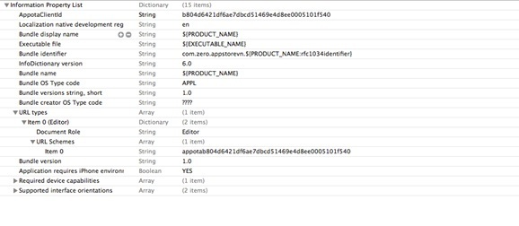

**Get Started**

Appota Game SDK is the simplest way to integrate user and payment for
your game in Appota system. This SDK provides solutions for payment
methods such as: SMS, Card. Internet Banking, Paypal and Apple Payment.

**Steps to integrate SDK:**

​1. Setup Appota SDK

​2. Config SDK

​3. Integrate SDK

-------------------------------

**1. Setup Appota SDK**

**Import Appota.framework into project**

Drag and drop AppotaSDK.framework and AppotaBundle.bundle into your project.

Tick on checkbox: “Copy items into destination group's folder (if needed)”.

In Project app’s target settings section, find [Build phases] and open
Link Binary with Libraries. Click on ‘+’ button and add these frameworks:

```
AppotaSDK, CoreText, StoreKit, AudioToolBox, MobileCoreServices, AVFoudation, CoreVideo,
MessageUI, Security, SystemConfiguration, CFNetwork, OpenGLES, CoreMedia, libxml2.dylib, libsqlite3.dylib
```


In project build settings section, find Other Linker Flags, add two
values: -ObjC và -all\_load.


Import header file to source file where do you want to use SDK:

``` objective-c
#import <AppotaSDK/AppotaSDK.h>
```

**Config plist with CLIENT_KEY**

Add 1 string AppotaClientId with the value is CLIENT_ID (details about CLIENT_ID are in section of getting ACCESS_TOKEN)

Add more schema: Add 1 string URL Array types. Creat 1 item more with URL Schemes is appotaCLIENT_ID.

For example: If CLIENT_ID = b804d6421df6ae7dbcd51469e4d8ee0005101f540,
schemes will be appotab804d6421df6ae7dbcd51469e4d8ee0005101f540.



**2. Config SDK**

**Config SDK in Appdelegate:**

**+AppDelegate.h**

Add protocol AppotaGameSDKConfigureDelegate to AppDelegate

**+AppDelegate.m**

Config AppotaGameSDK after setting up windows in Appdelegate (reference
AppotaGameTest/AppDelegate.m) by AppotaGameSDKConfigure class.

- Init payment list (AppotaPayment class represents payment item)

- Init AppotaGameSDKConfigure with:
 - CLIENT_ID - Config on dev.appota.com
 - CLIENT_SECRET - Config on dev.appota.com
 - INAPP_API_KEY - Config on dev.appota.com 
 - noticeUrl - URL for payment notification 
 - checkUpdate option - Enable this option for automatic update by AppotaGameSDK
 - autoShowPaymentButton option:
 - YES: Enable this option for automatic show a payment button
floating on game screen
 - NO: Don't show the floating payment button (Payment view can
be shown via function [AppotaGameSDKConfigre showPaymentView])

- Set delegate for AppotaGameSDKConfigure (should use AppDelegate for
delegate)
- Handle login status by protocol function - (void)
didFinishLogin:(NSDictionary *)userInfoDict (UserInfo dict can be used
for verification process)

**3. Integrate SDK**
