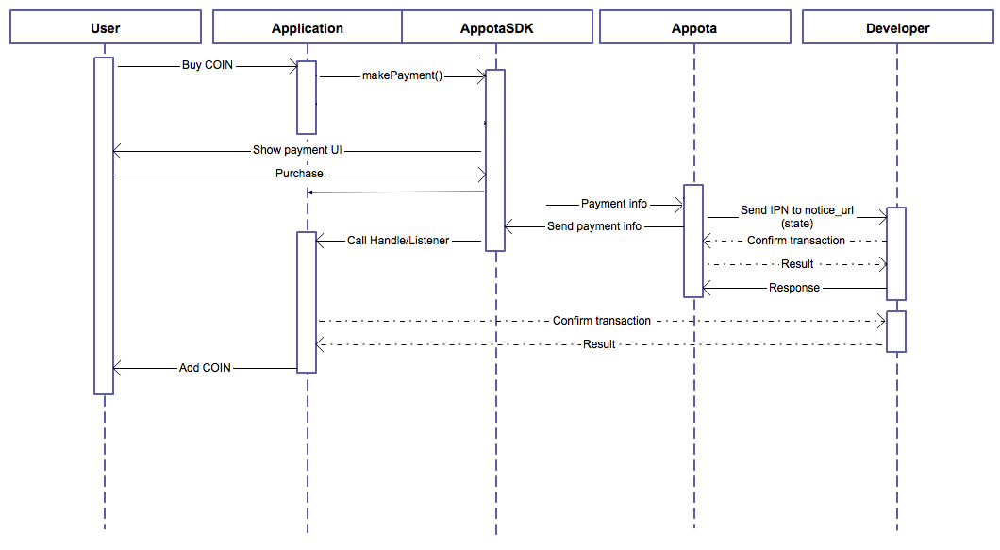

<<<<<<< HEAD
Other languages: [English](README_EN.md) | [Chinese](README_CN.md)

**Get Started**

Appota Game SDK cho iOS là cách đơn giản nhất để tích hợp user và thanh toán cho ứng dụng của bạn trên hệ thống Appota. SDK này cung cấp giải pháp cho các hình thức thanh toán: SMS, thẻ cào, internet banking, Paypal và Apple Payment.

**Các bước tích hợp SDK:**

​1. Cài đặt Appota SDK

​2. Cấu hình SDK

​3. Tích hợp

​4. Hiểu về Appota SDK flow

 

**1. Cài đặt Appota SDK**

**Import Appota.framework vào project**

Kéo và thả AppotaSDK.framework and AppotaBundle.bundle vào project của bạn.

Tick vào checkbox: “Copy items into destination group's folder (if needed)”.
 
Trong phần Project app’s target settings, tìm [Build phases] và mở [Link Binary with Libraries]. Click dấu ‘+’ và thêm các frameworks sau:

```
    AppotaSDK, QuaztCore, CoreText, StoreKit, AudioToolBox, MobileCoreServices, AVFoudation, CoreVideo,
    MessageUI, Security, SystemConfiguration, CFNetwork, OpenGLES, CoreMedia, libxml2.dylib, libsqlite3.dylib
```


Trong phần [project build settings], tìm [Other Linker Flags], thêm 2 giá trị sau: -ObjC, -lc++ và -all\_load.


Import file header vào file code nơi bạn muốn sử dụng SDK:

``` c
    #import <AppotaSDK/AppotaSDK.h>
```

**Config plist với CLIENT\_KEY**\
 
Thêm 1 trường AppotaClientId với giá trị là CLIENT\_ID. Add thêm schema: Thêm 1 trường URL types kiểu Array. Tạo thêm 1 item với URL Schemes là appotaCLIENT\_ID.
 
Ví dụ nếu CLIENT\_ID = b804d6421df6ae7dbcd51469e4d8ee0005101f540 thì schemes sẽ là appotab804d6421df6ae7dbcd51469e4d8ee0005101f540.


**2. Cấu hình SDK**

**Cấu hình SDK trong Appdelegate:**

**+AppDelegate.h**

Thêm giao thức AppotaGameSDKConfigureDelegate vào AppDelegate.

**+AppDelegate.m**

Sử dụng class AppotaGameSDKConfigure để cấu hình SDK.

- Khởi tạo danh sách thanh toán (mô tả item thanh toán trong class AppotaPayment).

- Khởi tạo AppotaGameSDKConfigure với 
     CLIENT\_ID: Cấu hình trên dev.appota.com (dùng SANDBOX\_CLIENT\_ID trong chế độ sandbox).\
     CLIENT\_SECRET: Cấu hình trên dev.appota.com \
     INAPP\_API\_KEY: Cấu hình trên dev.appota.com (dùng SANDBOX\_INAPP\_API\_KEY trong chế độ sandbox).\
     noticeUrl: URL gọi lúc giao dịch hoàn thành.\
     configUrl: URL tới file cấu hình JSON.

``` c
    [AppotaGameSDKConfigure configureWithClientID:CLIENT_ID
        withClientSecret:CLIENT_SECRET
        withInAppAPIKey:INAPP_API_KEY
        withState:@"YOUR_PAYMENT_STATE" 
        withNoticeUrl:@"http://filestore9.com/test.php"
        withConfigUrl:@"http://filestore9.com/config.json" 
    ];
```

Để tích hợp cho phép đăng nhập bằng tài khoản Facebook, Google, Twitter vui lòng theo các chỉ dẫn của từng SDK. Đối với FacebookSDK cấu hình Info.plist và *FacebookAppID*, đối với Google SDK cấu hình *GOOGLE_CLIENT_ID* và *GOOGLE_CLIENT_SECRET* (tham khảo [AppotaGameTest](GameIntegration/AppotaGameTest)).
Thông tin chi tiết cấu hình Facebook login, Google login tại
* [Cấu hình Facebook Login](FBLOGIN_INTEGRATION_EN.md)
* [Cấu hình Google Login](GGLOGIN_INTEGRATION.md)
* [Cấu hình TWITTER Login](TWITTERLOGIN_INTEGRATION_EN.md)


- Đặt delegate cho AppotaGameSDKConfigure (nên sử dụng Appdelegate cho delegate).

``` c
    [AppotaGameSDKConfigure sharedGameConfig].delegate = self;
```

- Handle trạng thái đăng nhập bằng hàm callback - *(void) didFinishLogin:(NSDictionary \*)userInfoDict* (UserInfo dict có thể được sử dụng cho quá trình xác nhận).

- Handle trạng thái logout bằng hàm callback - *(void) didLogOut:(NSString\*) userName*

- Handle trạng thái giao dịch bằng hàm callback - *(void) didFinishPaymentWithDictionary:(NSDictionary\*)paymentDict
withState:(AppotaPaymentState)status withError:(NSError\*) error*

- Nếu bạn sử dụng thêm dòng handle mở URL trong AppDelegate của bạn:

``` c
(BOOL) application:(UIApplication \*)application openURL:(NSURL \*)url sourceApplication:(NSString \*)sourceApplication annotation:(id)annotation {\
    return [AppotaGameSDKConfigure handleOpenURL:url sourceApplication:sourceApplication annotation:annotation];\
 }
```

**Cấu hình JSON:**

Appota Game SDK cung cấp một phương thức cấu hình tiện lợi với nhiều tùy
chọn cho nhà phát triển. Bạn cần thực hiện các bước sau để sử dụng
phương thức này:

- Sử dụng công cụ JSON Generator để tạo ra file JSON chứa các cấu hình
([https://developer.appota.com/sdktool.php](https://developer.appota.com/sdktool.php)).
 - Upload file cấu hình JSON lên một host có thể truy cập được.\
 - Thiết đặt \*[AppotaGameSDKConfigure sharedGameConfig].jsonConfigUrl với đường dẫn tới file JSON.

 

**3. Integrate SDK**

Tất cả các hàm thực thi SDK có thể được truy cập qua class AppotaGameSDKConfigure. Các hàm hỗ trợ:

 +showSDKView: Hiển thị giao diện SDK.
 +logOut: Hiển thị giao diện logout.
 +(NSDictionary): getUserInfo\* Lấy thông tin user (acces\_token,username, email…) trong NSDictionary
 +(NSString): getUserName: Lấy username
 +(NSString): getUserId: Lấy userid
 +(NSString): getAccessToken: Lấy access token
 +showPaymentView: Hiển thị giao diện thanh toán
 +showLoginView: Hiển thị giao diện login
 +showSwitchUserView: Hiển thị giao diện chuyển user
 +showPaymentButton, hidePaymentButton: Hiện/ẩn nút bấm Appota SDK mặc định
 +sharedGameConfig: Singleton shared instance của AppotaGameSDKConfigure

 

**4. Appota SDK Flow**


User login flow using Appota SDK



Payment flow using Appota SDK

For more detail about this flow, please refer to Wiki: https://github.com/appota/ios-game-sdk/wiki
Thông tin thêm về User Integration và Sandbox mode xin truy cập link sau: https://developer.appota.com/docs/integrated_user.html

=======
#Version 4 of the Appta Game SDK for iOS

<b> Version 4 of the Appota Game for iOS has been published in this reposity and in Developer Preview. Version 3 will continue to be available in our [appota-ios-game-sdk3](https://github.com/appota/ios-game-sdk3) repository. </b>


##Highlights

* **Appota Login** – Support multiple login methods Appota, Google, Facebook, Twitter, Guest.
* **Appota Payment** – Support mutiple payment methos SMS, Card, E-Bank, Apple Payment.
* **Appota Analytics** – A service for collecting, visualizing, and understanding user and app data (session, active, error log, ...) at scale. Support **Push Notification** on multiple platforms (iOS, Android, WP).

## Overview
1. [Integrate SDK](#head1-integrate-sdk)
2. [Client API](#head1-client-api)
    * [Init and setup SDK](#head2-init-sdk)
    * [User function](#head2-user-function)
    * [Payment function](#head2-payment-function)
    * [Analytic function](#head2-analytic-function)
    * [Push notification function](#head2-push-notification-function)
3. [Class document](#head1-class-document)
4. [FAQ and Glossary](#head1-faq)

##1. Integrate SDK <a name = "head1-integrate-sdk"> </a>
The [sample apps](Sample/) are standalone projects that are already set up for you. You can also integrate the SDK for iOS with an existing application.

###1.1. Prerequisites <a name = "head2-prerequisites">  </a>
To get started with the Appota Game SDK for iOS, you can set up the SDK and start building a new project, or you can integrate the SDK in an existing project. You can also run the samples to get a sense of how the SDK works.

The Appota Game SDK for iOS supports the following versions of software:

* Xcode 6 and later
* iOS 6 and later

###1.2. Obtain app api key and client key <a name="head2-obtain-app-api-key-and-client-key"> </a>
* Retreive Appota app information `ClientKey`, `APIKey`, `ClientSecret` from app dashboard. <a name="head3-appota-appid"> </a> If you haven't already registered your app with Appota by creating a Appota app, you should [create a new app](https://developer.appota.com/manage-content.html):  
* Retreive Facebook Application ID. <a name="head3-facebook-appid"> </a> [Detail about how to create ,retreive and setup Facebook app info for iOS](https://developers.facebook.com/docs/ios/getting-started).  
* Retreive Google Client ID and Client Secret. <a name="head3-google-appid"> </a> [Detail about create, retreive and setup Google app for iOS](https://developers.google.com/+/mobile/ios/getting-started)


###1.3. Configure your XCode Project <a name="head2-configure-your-xcode-project"> </a>

####1.3.1. Add the Appota iOS SDK
 Open [ios-game-sdk/SDK](SDK/) and add [AppotaSDK.framework](SDK/AppotaSDK.framework), [AppotaBundle.bundle](SDK/AppotaBundle.bundle), [Facebook.framework](SDK/Facebook.framework) to your project. (Remember to choose **Create groups for any added folders** and select **Copy items into destination group's folder (if needed)**)


####1.3.2. Add framework dependencies and setting
Select your project from the Project Navigator, and choose your application's target.  
Open **Build Phases** tab, within **Link Binary with Libraries**, add the following frameworks:  

- `StoreKit.framework`  
- `Accounts.framework`  
- `Social.framework`  
- `Twitter.framework`
- `ImageIO.framework`

Open **Build Settings**, find **Other Linker Flags**, add `-ObjC` then check if **Link Frameworks Automatically**, **Enable Modules (C and Objectivce-C))** are set to `YES`


####1.3.3. Configure the Info `.plist`

- Open Info `plist` section add `FacebookAppID` key with value is your [Facebook AppID](#head3-facebook-appid).
- Open Info `plist` section add `GOOGLE_CLIENT_ID` and `GOOGLE_CLIENT_SECRET` key with value is your [Google Client Id and Sceret](#head3-google-appid).
- Open Info `plist` section add `AppotaAPIKey` key with value is your [Appota APIKey](#head3-appota-appid).
- Add url schemes:
	- Identifier Appota, URL Schemes: `appotaYOUR_CLIENT_KEY`, [Appota Client Key](#head3-appota-appid) can be retreived from developer portal
	- Identifier Facebook, URL Schemes: `fbYOUR_FACEOOK_APP_ID`, [Facebook AppID](#head3-facebook-appid) can be retreived from Facebook App Dashboard

The finished `.plist` should look like this or check the [sample apps](Sample/) for plist configuration


###1.4. Update the SDK to a Newer Version

When we release a new version of the SDK, you can pick up the changes as described below.

* In Xcode select the following frameworks, bundle and hit **delete** on your keyboard. Then select **Move to Trash**:

    * `ApppotaFramework.framework`
    * `FacebookFramework.framework`
    * `AppotaBundle.bundle`
    
* Follow the installation process [above](#head1-integrate-sdk) to include the new version of the SDK.


##2. Client API <a name="head1-client-api"> </a>

###2.1 Init and setup SDK <a name = "head2-init-sdk"> </a>
Related class and function:
[AppotaGameSDK clas - init function](class_references/AppotaGameSDK-class)  
Appota SDK init must be called once when application start via [AppotaGameSDK](SDK) class call `[AppotaGameSDK configure]` so most of the time it will be placed in `AppDelegate's` method `application:didFinishLaunchingWithOptions:`  
In `AppDelegate.h` add import `#import <AppotaSDK/AppotaSDK.h>` use `AppDelegate` as protocol:

```
@interface AppDelegate : UIResponder <UIApplicationDelegate, AppotaGameSDKCallback>

```

In `AppDelegate.m`:

```

- (BOOL)application:(UIApplication *)application didFinishLaunchingWithOptions:(NSDictionary *)launchOptions
{		
	// Your code is placed above
	[AppotaGameSDK configure];
 	[AppotaGameSDK sharedInstance].delegate = self;	
 }

```

Add handle open URL in function `application:openURL:sourceApplication:annotation:`

```
- (BOOL) application:(UIApplication *)application openURL:(NSURL *)url sourceApplication:(NSString *)sourceApplication annotation:(id)annotation {
    return [AppotaGameSDK handleOpenURL:url 						   sourceApplication:sourceApplication 							  annotation:annotation];
}

```
There are 2 functions to control SDK flows:

- `setKeepLoginSession:(BOOL)` <a name="set-keep-login-session"> </a> this function will control the Appota Login Session will be kept or deleted at app lauching (when deleted user has to login again when app start).   
**Note** If this function is not called, login session will be kept by default.
- `setAutoShowLoginDialog:(BOOL)` <a name="set-auto-show-login-dialog"> </a> this function will control the Appota Login View will be automatically show at app lauching (when user's not logged in) or you have to call [showLoginView](#show-login-view) function to show the LoginView. 
**Note** If this function is not called, login view will automatically show at app lauching (when user's not logged in)

###2.2. User function <a name="head2-user-function"> </a>
Related class and function:

- [AppotaGameSDK- init function](class_references/AppotaGameSDK-class)
- [AppotaUserLoginResult](class_references/AppotaUserLoginResult-class)

Once you've implemented init SDK function, start using login features.

####2.2.1. Show login view <a name = "head2-show-login-view"> </a>
As mentioned above login dialog flow can be control by function [setAutoShowLoginDialog:](#set-auto-show-login-dialog). Automatically show login view at app launching or manual call `showLoginView` when you need:  

```
[AppotaGameSDK showLoginView]

```
<a name="show-login-view"> </a>
Appota Login Dialog contains 5 authorization methods: **Facebook**, **Google**, **Twitter**, **Appota User** and **Quick Login**  


<!--####2.2.2 Configure login method <a name = "configure-login-method"> </a>
Appota SDK support 4 login methods: Quick login, Facebook login, Google login, Twitter Logins (all is enabled by default)  
Each method can be disabled or enabled by calling these functions:

```
[AppotaGameSDK setFacebookLoginEnable:(BOOL)]
[AppotaGameSDK setGoogleLoginEnable:(BOOL)]
[AppotaGameSDK setTwitterLoginEnable:(BOOL)]
[AppotaGameSDK setQuickLoginEnable:(BOOL)]

```
-->
####2.2.2. Handle authenticaiton callbacks <a name = "login-handle-login-response"> </a>

AppotaSDK provide 4 callbacks delegate for login defined in [`AppotaGameSDKCallback`](AppotaGameSDKCallback-class) , please implement these functions to `Appdelegate.m`

**Note** 4 callbacks are all `@required`

----
**Login succeed callback**  
Retreive Appota user info from `AppotaUserLoginResult` then post to your server to verify and create game user. For more detail about user integration on server: [User Integration](https://github.com/appota/ios-game-sdk/wiki/Integrate-user-system)  

**Note** Remember verify Appota UserID, UserName and Access token on your server before procceeding game user integration

```
- (void) didLoginSucceed:(AppotaUserLoginResult*) userLoginResult

```
|Parameter|Description|  
|-------|-----------|  
|userLoginResult|`userLoginResult` is [AppotaUserLoginResult](class_references/AppotaUserLoginResult-class) object of user information (username, user_id, access token)|

----
**Login fail callback**  
Callback when login have problems

```
- (void) didLoginFail;

```

----
**Logout callback**  
Callback after user logout with user name

```
- (void) didLogout:(NSString*) userName

```

----
**Close login view callback**  
Callback when user close login view at app launching

```
- (void) didCloseLoginView;
```

###2.2. Payment function <a name="head2-payment-function"> </a>

Related class and function:

- [AppotaGameSDK - payment function](class_references/AppotaGameSDK-class)
- [AppotaGameSDKCallback](class_reference/AppotaGameSDKCallback-class)
- [AppotaPaymentResult](class_references/AppotaUserLoginResult-class)

Because using AppotaSDK payment function you should understand Appota Payment mechanism and configuration. Please study Appota payment mechanism at [Appota Payment Document]() and payment configuration at [Appota Developer Portal]().

####2.2.1. Show payment view <a name="head3-show-payment-view"> </a>

---------
You have 3 methods to show payment view. Each payment view represents one or list of payment package. Each package contains information of game coin amount or in-game package. Find out more about payment package at [Appota Payment Package]()

** Show default list payment view **

You can show payment view with default list payment packages (which is configured on [Appota Developer Portal]())

```
[AppotaGameSDK showPaymentView]
```


----
** Show payment view for a specific package **

You can show a specific package depends on your in-game mechanism

```
[AppotaGameSDK showPaymentViewWithPackageID:];
```

----
** Show payment view from SDK floating button**

(Show image of floating button and then SDK show gif)

####2.2.2 Handle payment callback <a name="head3-handle-payment-callback"> </a>

---------
Every payment success will callback in `AppotaGameSDK` delegate (setup in [init function](#head2-init-sdk)). The callback functions should be in `AppDelegate.m`
There are 2 `@required` callback function defined in [AppotaGameSDKCallback](AppotaGameSDKCallback-class)

** Callback after a successful payment **

Depends on your payment machenism (APN or IPN, please readmore about [Appota Payment](Appota Payment)), proceed payment verification or alert payment succeed for user

```
- (void) didPaymentSuccessWithResult:(AppotaPaymentResult*) paymentResult withPackage:(NSString *) packageID;
```

|Parameter|Description|  
|-------|-----------|  
|`paymentResult`|`paymentResult` is [AppotaPaymentResult](class_references/AppotaUserLoginResult-class) object of payment information (transaction id, amount, ...)|
|`packageID`|`packageID` is id of the package has been bought, `packageID` is defined during payment configuration process|

----
** Callback for payment state **

**PAYMENT_STATE** is required for our SDK to make correct payment with package. Depends on your payment package implement this function and return a correct payment state. [Detail about payment state]().  
For example packageID: com.gold.package1 - (defined in your developer page) corresponds with a package of 1000 gold and current game user is X in server Y. Then payment state can be constructed : 1000_gold_X_Y (depends on your format).

```
-(NSString*) getPaymentStateWithPackageID:(NSString*) packageID;

```
|Parameter|Description|  
|-------|-----------|  
|`packageID`|`packageID` is id of the package has been bought, `packageID` is defined during payment configuration process|

###2.3. Analytic function <a name="head2-analytic-function"> </a>

Appota SDK support calling track for view and event. These track information is very use for game advertisement and tracking.

** View tracking function **  
When enter a view send view for tracking

```
public void SendView(string name);
```

** Event tracking function **  
When user perform an event send event for tracking

```
public void SendEvent(string category,string action,string label)
```
Define `category`, `action`, `label` detail of the action


###2.3. Push notification function <a name="head3-push-notification-function"> </a>
** Register push notification with groupname **  
Register push notification (currenly only support iOS). Use group name to choose user group for easy pushing (for example only push user in server 1 then groupName = "server 1").

```
public void setPushGroup(string groupName)
```
##3. Class Document <a name="head1-class-document"> </a>
- [AppotaSDKHandler](class-document/UnityClasses.html#init-function)
- [AppotaSDKReceiver](class-document/UnityClasses.html#appota-sdk-receiver)
- [AppotaSession](class-document/UnityClasses.html#appota-session)
- [AppotaPaymentResult](class-document/UnityClasses.html#appota-payment-result)

##4. FAQ and Glossary <a name="head1-faq"></a>
- `IPN` is payment machenism used by Appota System to increase gold for game user. Detail in https://github.com/appota/ios-game-sdk/wiki/Passive-Confirmation-via-IPN
- `PackageID` each payment package in game should be defined along with a package ID (provided by SDKTool) to identify package.
- `PaymentState` payment state must be implemented in `GetPaymentState` function. And use `PackageID` and game server information to build up `PaymentState`.   
For example packageID: `com.gold.package1` - (defined in integration process) corresponds with a package of 1000 gold and current game user is X in server Y. Then payment state can be constructed : com.gold.package1_1000_gold_X_Y (depends on your format).
>>>>>>> 742ebbc904e88d59a55a34d69b5ec5189920bb95
