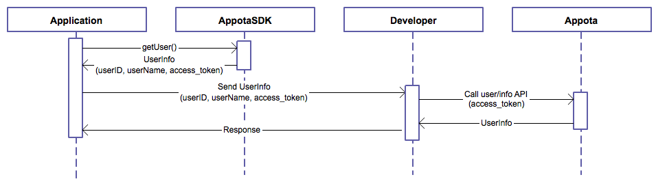
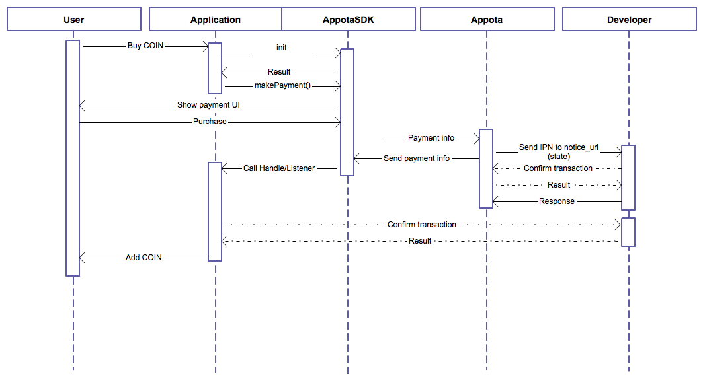

Other languages: [Vietnamese](README.md) | [English](README_EN.md)

**Get Started**

iOS Appota Game SDK 是让你的应用集成Appota 用户和支付系统的最简单方式。 本SDK提供： 短信、充值卡、网络银行、支付宝、Google Play Payment等各种支付方式的解决方案。


**添加SDK的步骤:**

1.安装Appota SDK

2. 配置 SDK

3. 集成

4. 了解 Appota SDK flow

 

**1. 安装 Appota SDK**

**把Appota.framework Import 到 project**

把AppotaSDK.framework 和 AppotaBundle.bundle拖放到你的project

在 checkbox: “Copy items into destination group's folder (if needed)”画勾
 在 Project app’s target settings, 找到[Build phases] 然后打开 [Link Binary with Libraries]. 点击 ‘+’ 号然后添加以下的frameworks:

```
    AppotaSDK, QuaztCore, CoreText, StoreKit, AudioToolBox, MobileCoreServices, AVFoudation, CoreVideo,
    MessageUI, Security, SystemConfiguration, CFNetwork, OpenGLES, CoreMedia, libxml2.dylib, libsqlite3.dylib
```


在 [project build settings], 找到 [Other Linker Flags], 添加以下两个价值: -ObjC, -lc++ và -all\_load.


把file header import到你想要使用SDK 的file code：

``` c
    #import <AppotaSDK/AppotaSDK.h>
```

**Config plist với CLIENT\_KEY**\
 
Thêm 1 trường 添加一个AppotaClientId 价值为 CLIENT\_ID. 再添加schema: 添加一个Array式的 URL types.建造另一个item其URL Schemes是appotaCLIENT\_ID。
 
比如：如果 CLIENT\_ID = b804d6421df6ae7dbcd51469e4d8ee0005101f540 ，那schemes将是 appotab804d6421df6ae7dbcd51469e4d8ee0005101f540.


**2. 配置 SDK**

** Appdelegate配置SDK:**

**+AppDelegate.h**

把AppotaGameSDKConfigureDelegate protocol 添加到AppDelegate

**+AppDelegate.m**

使用 class AppotaGameSDKConfigure 以便配置 SDK.

-初始化付费列表（在class AppotaPayment描写支付item）

- 初始化 AppotaGameSDKConfigure 用：
     CLIENT\_ID:在dev.appota.com 配置(在sandbox状态用SANDBOX\_CLIENT\_ID).\
     CLIENT\_SECRET: 在dev.appota.com \配置
     INAPP\_API\_KEY: 在dev.appota.com 配置(在 sandbox状态用SANDBOX\_INAPP\_API\_KEY).\
     noticeUrl:当交易成功是叫出的URL.\
     configUrl:到JSON配置文件的URL

``` c
    [AppotaGameSDKConfigure configureWithClientID:CLIENT_ID
        withClientSecret:CLIENT_SECRET
        withInAppAPIKey:INAPP_API_KEY
        withState:@"YOUR_PAYMENT_STATE" 
        withNoticeUrl:@"http://filestore9.com/test.php"
        withConfigUrl:@"http://filestore9.com/config.json" 
    ];
```

如果你想要集成Facebook, Google, Twitter账号登录的功能，请参考每类SDK的指导。使用FBSDK要配置info.plist 和 FacebookAppId， 使用Google SDK要配置googleClientId（参考AppotaGameTest）

-给 AppotaGameSDKConfigure 设定delegate (应该使用 Appdelegate).

``` c
    [AppotaGameSDKConfigure sharedGameConfig].delegate = self;
```

-用callback函数 - *(void) didFinishLogin:(NSDictionary \*)userInfoDict*以便Handle登录状态
 (UserInfo dict可在确认过程中使用). 
-用 callback 函数- *(void) didLogOut:(NSString\*) userName* 以便Handle退出状态

-用callback函数 - *(void) didFinishPaymentWithDictionary:(NSDictionary\*)paymentDict 以便Handle交易状态
withState:(AppotaPaymentState)status withError:(NSError\*) error*

-如果要使用更多handle， 在 AppDelegate打开URL：

``` c
(BOOL) application:(UIApplication \*)application openURL:(NSURL \*)url sourceApplication:(NSString \*)sourceApplication annotation:(id)annotation {\
    return [AppotaGameSDKConfigure handleOpenURL:url sourceApplication:sourceApplication annotation:annotation];\
 }
```

**配置JSON:**

Appota Game SDK给开发商提供一个便利的配置方式。 您需要进行一下的步骤以便使用Appota Game SDK


- 使用JSON Generator来 创造有配置的JSON 文件
([https://developer.appota.com/sdktool.php](https://developer.appota.com/sdktool.php)).
 -把JSON配置文件Upload 到可以访问的host
 - 设置 \*[AppotaGameSDKConfigure sharedGameConfig].jsonConfigUrl 传到 file JSON的链接

 

**3. 集成 SDK**

所有的SDK实施函数都能从class AppotaGameSDKConfigure进入。 各个辅助函数：

 +showSDKView: 显示 SDK界面
 +logOut: 显示 logout界面
 +(NSDictionary): getUserInfo\*在 NSDictionary拿取 user 信息(acces\_token,username, email…) 
+(NSString): getUserName: 拿取 username
 +(NSString): getUserId: 拿取 userid
 +(NSString): getAccessToken: 拿球 access token
 +showPaymentView: 显示交易界面
 +showLoginView: 显示login界面
 +showSwitchUserView:显示switch user 界面
 +showPaymentButton, hidePaymentButton:显示/隐藏Appota SDK默认按钮
 +sharedGameConfig: AppotaGameSDKConfigure 的Singleton shared instance 
 

**4. Appota SDK Flow**



User login flow using Appota SDK



Payment flow using Appota SDK

关于 该flow的更详细信息，请进入Wiki: https://github.com/appota/ios-game-sdk/wiki

