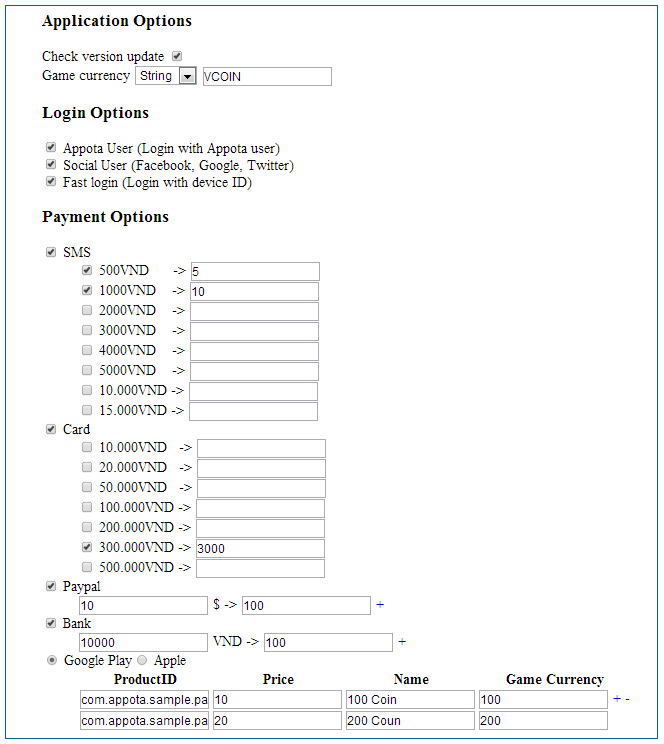

#Config.json#

Appota Game SDK sử dụng một file cấu hình theo định dạng JSON, cho phép
nhà phát triển khai báo các tùy chọn đăng nhập và thanh toán một cách dễ
dàng. Để có cấu hình JSON này, Appota cung cấp một công cụ tên là
ConfigJSON Generator.

##Sử dụng ConfigJSON Generator:##

Truy cập công cụ tại địa chỉ:
[https://developer.appota.com/sdktool.php](https://developer.appota.com/sdktool.php)

Tick chọn những option bạn muốn có trong game.

Bấm Generate để sinh ra mã JSON.

 

##1. Tùy chọn Ứng dụng##

**Check version update**

Kiểm tra các phiên bản cập nhật khi vào game và force update nếu có
phiên bản mới.

**Game currency**

Đơn vị tiền tệ của game, có thể sử dụng text hoặc hình ảnh (yêu cầu
upload).

##2. Tùy chọn Đăng nhập##

**Appota User**

Cho phép sử dụng tài khoản Appota đăng nhập vào game.

**Social User**

Cho phép sử dụng tài khoản mạng xã hội Facebook, Google, Twitter đăng
nhập vào game.

**Fast Login**

Cho phép dùng ID của thiết bị để đăng nhập nhanh vào game.

##3. Tùy chọn Thanh toán##

**SMS**

Cho phép sử dụng hình thức thanh toán SMS. Tick để lựa chọn các mệnh giá
và số tiền ảo tương ứng.

**Card**

Cho phép sử dụng hình thức thanh toán Thẻ cào. Tick để lựa chọn các mệnh
giá và số tiền ảo tương ứng.

**Paypal**

Cho phép sử dụng hình thức thanh toán Paypal. Nhập vào số tiền (USD) và
số tiền ảo tương ứng.

**Bank**

Cho phép sử dụng hình thức thanh toán Internet Banking. Nhập vào số tiền
(VNĐ) và số tiền ảo tương ứng.

**Google Play Payment hoặc Apple Payment**

Cho phép sử dụng hình thức thanh toán Google Payment hoặc Apple Payment
(phụ thuộc vào loại ứng dụng Android/iOS). Nhập vào các thông tin sau:

- ProductID: Mã IAP item được Appota cung cấp.\
 - Price: Giá tiền (USD)\
 - Name: Tên item\
 - Game Currency: Số tiền ảo

##4 - JSON mẫu##

Khai báo các tùy chọn như sau:



Bấm nút Generate sẽ cho kết quả là chuỗi JSON:

``` json
{"checkUpdate":true,"gameCurrency":{"type":"STRING","data":"VCOIN"},"loginMethods":["LOGIN_APPOTA",
"LOGIN_SOCIAL","LOGIN_FAST"],"paymentMethods":[{"method":"PAYMENT_SMS","options":[{"currency":"VND",
"country":"VN","amounts":[{"amount":500,"gameCurrency":5},{"amount":1000,"gameCurrency":10}]}]},
{"method":"PAYMENT_CARD","options":[{"currency":"VND","country":"VN","amounts":[{"amount":300000,
"gameCurrency":3000}]}]},{"method":"PAYMENT_PAYPAL","currency":"USD","options":[{"country":"VN",
"amounts":[{"amount":10,"gameCurrency":100}]}]},{"method":"PAYMENT_INTERNET_BANKING",
"options":[{"currency":"VND","country":"VN","amounts":[{"amount":10000,"gameCurrency":100}]}]},
{"method":"PAYMENT_GOOGLE_PLAY","items":[{"productid":"com.appota.sample.pack1","price":"10",
"name":"100 Coin","gameCurrency":100},{"productid":"com.appota.sample.pack2","price":"20",
"name":"200 Coin","gameCurrency":200}]}]}
```
